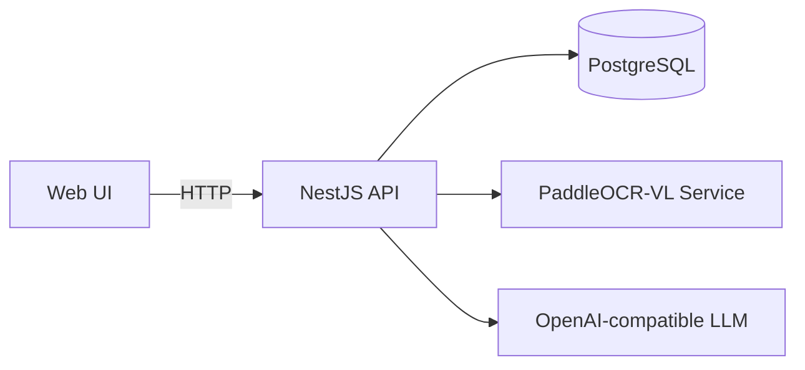

# PyToYa — Invoice Extraction Web App (TypeScript)

> **Deprecation notice:** The legacy Python CLI (`main.py`, `src/*.py`, `requirements.txt`, root `config.yaml`, `.venv/`, `results/`) has been removed. Use the NestJS API + web UI in this repository instead.

## What’s in this repo

- **API**: NestJS backend at `src/apps/api`
- **Web**: React/Vite frontend at `src/apps/web`
- **Shared**: Shared types/utilities at `src/shared`



## Quick start

```bash
npm install
npm run dev
```

The API config template is `src/apps/api/config.yaml` (Handlebars); secrets and environment-specific values are provided via environment variables.

## Docs

- `docs/EXTRACTION_API.md` (API endpoints)
- `docs/OCR_PREVIEW_AND_SELECTIVE_EXTRACTION_API.md` (OCR preview + selective extraction)
- `docs/OCR_PREVIEW_USER_GUIDE.md` (UI workflow)
- `docs/WEB_APP.md` (UI behavior)

## Tests / Quality

```bash
npm run test
npm run lint
npm run type-check
```
