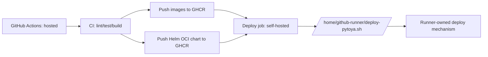

# CI/CD (GHCR-only + Deploy Signal)

This repo uses GitHub Actions to:
- run CI checks (lint/type-check/tests)
- publish Docker images + Helm chart to **GHCR only**
- signal production deployment by invoking a runner-local script: `/home/github-runner/deploy-pytoya.sh`

## Architecture



## GitHub configuration

### Required secrets
- `GHCR_TOKEN`: GitHub PAT used to push images and charts to GHCR.

Notes:
- If the PAT belongs to a service account user, also set `GHCR_USERNAME` to that username.

### Optional secrets
- `GHCR_USERNAME`: only needed when `GHCR_TOKEN` is set and you want to override `${{ github.actor }}`.

### Recommended variables
- `GHCR_OWNER`: defaults to `github.repository_owner`
- `CHART_ID`: defaults to `pytoya`

## Deploy job contract (runner-local)

The deploy job MUST only send a deployment signal:

```bash
/home/github-runner/deploy-pytoya.sh \
  --chart oci://ghcr.io/<ORG>/charts/pytoya \
  --chart-version <version> \
  --images '{"api":"ghcr.io/<ORG>/pytoya/api:<tag>","web":"ghcr.io/<ORG>/pytoya/web:<tag>"}'
```

Reference implementation (copy to the runner path on Linux):
- `scripts/deploy-pytoya.sh`

The runner owns:
- Kubernetes credentials (`KUBECONFIG` / service account)
- GHCR credentials for **pulling** chart/images (if private)
- environment-specific behavior (values files, namespaces, etc.)

Runner prerequisites (for the reference script):
- `helm`
- `jq`

## Credentials: where they live

This CI/CD design intentionally separates credentials by responsibility.

### 1) GitHub Actions → GHCR (publish)
Used by GitHub Actions to push images/charts to GHCR.

- GitHub secret: `GHCR_TOKEN` (PAT with `write:packages`)
- Optional: `GHCR_USERNAME` (the PAT owner; only needed if it is not `${{ github.actor }}`)

This token is **not** used by Kubernetes and is **not** used by the self-hosted runner at deploy time.

### 2) Self-hosted runner → GHCR (Helm chart pull)
Used by the deploy mechanism (runner-local) to pull the Helm OCI chart if the chart is private.

As the user that runs `/home/github-runner/deploy-pytoya.sh` (typically `github-runner`), run once:

```bash
echo "$GHCR_READ_TOKEN" | helm registry login ghcr.io -u "<github-username>" --password-stdin
```

Token requirements (runner-local):
- `read:packages` (and repo access if the package is tied to a private repo)

### 3) Kubernetes/K3s → GHCR (image pulls)
Used by nodes/pods to pull private GHCR images.

Option A (namespace `imagePullSecret`, recommended):
```bash
kubectl -n pytoya create secret docker-registry ghcr-pull \
  --docker-server=ghcr.io \
  --docker-username="<github-username>" \
  --docker-password="$GHCR_READ_TOKEN"
```

Then configure your runner-managed values file to include:
- `global.imagePullSecrets: ["ghcr-pull"]`

Option B (K3s node-level registry config):
- Configure `/etc/rancher/k3s/registries.yaml` on each node with GHCR auth.

### 4) Self-hosted runner → Kubernetes API
Used by the deploy mechanism to apply the release.

Common approach (K3s kubeconfig):
- Copy K3s kubeconfig to the runner user (example path): `/home/github-runner/.kube/config`
- Ensure the `server:` address is reachable from the runner (not `127.0.0.1`)
- Ensure `KUBECONFIG` is set for the deploy script environment (or default kubeconfig is readable)

## K3s notes (private GHCR images)

To let K3s pull private GHCR images, configure one of:
- a namespace-scoped `imagePullSecret` and set Helm `global.imagePullSecrets`
- node-level `/etc/rancher/k3s/registries.yaml`

This is runner/cluster configuration and is intentionally not stored in GitHub Actions.
