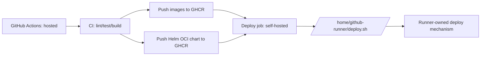

# CI/CD (GHCR-only + Deploy Signal)

This repo uses GitHub Actions to:
- run CI checks (lint/type-check/tests)
- publish Docker images + Helm chart to **GHCR only**
- signal production deployment by invoking a runner-local script: `/home/github-runner/deploy.sh`

## Architecture



## GitHub configuration

### Required secrets
- `GHCR_TOKEN`: GitHub PAT used to push images and charts to GHCR.

Notes:
- If the PAT belongs to a service account user, also set `GHCR_USERNAME` to that username.

### Optional secrets
- `GHCR_USERNAME`: only needed when `GHCR_TOKEN` is set and you want to override `${{ github.actor }}`.

### Recommended variables
- `GHCR_OWNER`: defaults to `github.repository_owner`
- `APP_ID`: defaults to `pytoya`
- `CHART_ID`: defaults to `pytoya`

## Deploy job contract (runner-local)

The deploy job MUST only send a deployment signal:

```bash
/home/github-runner/deploy.sh \
  --app pytoya \
  --chart oci://ghcr.io/<ORG>/charts/pytoya \
  --chart-version <version> \
  --images '{"api":"ghcr.io/<ORG>/pytoya/api:<tag>","web":"ghcr.io/<ORG>/pytoya/web:<tag>"}'
```

The runner owns:
- Kubernetes credentials (`KUBECONFIG` / service account)
- GHCR credentials for **pulling** chart/images (if private)
- mapping from `--app` to environment-specific behavior (values files, namespaces, etc.)

## K3s notes (private GHCR images)

To let K3s pull private GHCR images, configure one of:
- a namespace-scoped `imagePullSecret` and set Helm `global.imagePullSecrets`
- node-level `/etc/rancher/k3s/registries.yaml`

This is runner/cluster configuration and is intentionally not stored in GitHub Actions.

