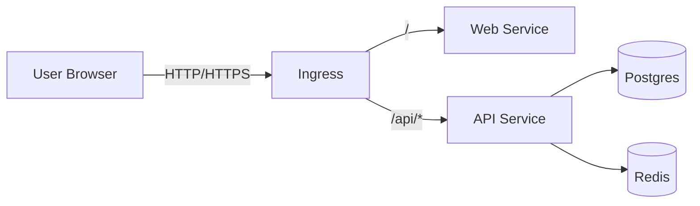

# Kubernetes Deployment (Helm)

PyToYa ships with a Helm chart at `helm/pytoya/` that deploys:
- NestJS API
- Vite Web
- PostgreSQL
- Redis
- Optional Worker (BullMQ)

## Architecture



## Build & Push Images

Build from the repo root (the Dockerfiles depend on the root `package-lock.json` / workspaces):

```bash
# API
docker build -t registry.dev.lan/pytoya/api:1.0.0 -f src/apps/api/Dockerfile . \
  --build-arg NODE_IMAGE=registry.dev.lan/<your-node-mirror>:20-alpine
docker push registry.dev.lan/pytoya/api:1.0.0

# Web (compile the API base URL into the frontend bundle)
docker build -t registry.dev.lan/pytoya/web:1.0.0 -f src/apps/web/Dockerfile . \
  --build-arg VITE_API_URL=/api
docker push registry.dev.lan/pytoya/web:1.0.0
```

Notes:
- `NODE_IMAGE` MUST point to your internal mirror of `node:20-alpine` (examples: `registry.dev.lan/library/node:20-alpine` or `registry.dev.lan/node:20-alpine`).

### Host-based deployment (recommended)
For simple multi-app deployments behind a shared gateway, prefer using a dedicated hostname (example: `pytoya.example.com`) and keep PyToYa root-hosted:

```bash
docker build -t registry.dev.lan/pytoya/web:1.0.0 -f src/apps/web/Dockerfile . \
  --build-arg VITE_API_URL=/api
```

## Deploy with Helm

```bash
helm upgrade --install pytoya helm/pytoya \
  --namespace pytoya \
  --create-namespace \
  --set global.imageRegistry=registry.dev.lan \
  --set api.tag=1.0.0 \
  --set web.tag=1.0.0 \
  --set postgres.auth.password=change-me \
  --set secrets.dbPassword=change-me \
  --set secrets.jwtSecret=change-me
```

### Smoke checks
- Web loads: `/`
- Deep link refresh: `/projects` (refresh should still load)
- Auth redirect: `/login?next_url=...`
- API health: `/api/health`
- Uploads (authenticated): `/api/uploads/*`
- WebSocket transport path: `/api/socket.io` (namespace remains `/manifests`)

### Optional: separate worker deployment
To scale BullMQ processing independently from HTTP, enable the worker deployment:

```bash
helm upgrade --install pytoya helm/pytoya \
  --namespace pytoya \
  --set worker.enabled=true
```

### Production Deployment

Use the Helm helper script for production deployment.

```powershell
pwsh -File scripts/deploy-helm.ps1 `
  -Environment prod `
  -PostgresPassword change-me `
  -JwtSecret change-me `
  -Registry registry.prod.lan `
  -ApiTag 1.0.0 `
  -WebTag 1.0.0 `
  -Namespace pytoya `
  -ReleaseName pytoya
```

Notes:
- Values files live under `helm/pytoya/` (e.g., `values-prod.yaml`).
- The chart can optionally run a pre-install/pre-upgrade migration Job when `migrations.enabled=true`.
- The chart can optionally run a post-install/post-upgrade admin seed Job when `admin.username` and `admin.password` are provided.
- `secrets.dbPassword` defaults to `postgres.auth.password` if not provided.

### CI/CD deployment

The GitHub Actions workflow publishes images + chart to GHCR and then signals deployment by invoking `/home/github-runner/deploy-pytoya.sh` on a self-hosted runner.

See `docs/CICD.md` for the deploy contract and runner/cluster requirements.

Quick checklist for private GHCR:
- Runner can pull the chart: `helm registry login ghcr.io ...` (runner-local credential)
- K3s can pull images: either `global.imagePullSecrets` + `docker-registry` secret, or K3s `registries.yaml`
- Runner can reach the cluster: valid `KUBECONFIG` for the user executing the deploy script

## NodePort (No Ingress)

If you don't have (or don't want) an Ingress controller, you can expose Services via NodePort.

Notes:
- NodePorts expose your services on every node IP. Treat this as dev-only unless you lock it down.
- If you don't set `*.service.nodePort`, Kubernetes assigns a free port automatically.

### Dependencies Only (Postgres + Redis)

PowerShell helper:

```powershell
pwsh -File scripts/deploy-deps-nodeport.ps1 -PostgresPassword change-me
```

Manual Helm command:

```bash
helm upgrade --install pytoya-dev helm/pytoya \
  --namespace pytoya-dev \
  --create-namespace \
  --set global.namespace=pytoya-dev \
  --set api.enabled=false \
  --set web.enabled=false \
  --set ingress.enabled=false \
  --set postgres.service.type=NodePort \
  --set redis.service.type=NodePort \
  --set postgres.auth.password=change-me \
  --set secrets.jwtSecret=dummy
```

Get the NodePorts:

```bash
kubectl get svc -n pytoya-dev
```

### Dev Deps + Local .env.local Helper

Use the PowerShell helper to read NodePorts and update `src/apps/api/.env.local`:

```powershell
pwsh -File scripts/setup-dev-k8s-deps.ps1 -SkipDeploy -Namespace pytoya-dev -ReleaseName pytoya-dev
```

The setup helper can also deploy:

```powershell
pwsh -File scripts/setup-dev-k8s-deps.ps1 -PostgresPassword change-me -Namespace pytoya-dev -ReleaseName pytoya-dev
```

Notes:
- The helper writes `DB_HOST`, `DB_PORT`, `REDIS_HOST`, `REDIS_PORT`, `DB_USERNAME`, `DB_PASSWORD`, `DB_NAME`,
  `JWT_SECRET` to `src/apps/api/.env.local`.
- Pass `-EnvPath` to write a different env file.
- If you want different secrets, pass `-JwtSecret` and `-LlmApiKey`, or edit the env file after generation.
- The helper creates or updates the Postgres app user by default (use `-SkipDbUserSetup` to skip).
- If `-NodeIp` is not provided, the helper prompts for a reachable node IP.

To run the API locally after generation:
```bash
npm run dev:api
```

## Verify

```bash
kubectl get pods -n pytoya
kubectl get svc -n pytoya
kubectl get ingress -n pytoya
```

If you have an Ingress host configured, open:
- `https://<host>/` (web)
- `https://<host>/api/health` (api)
