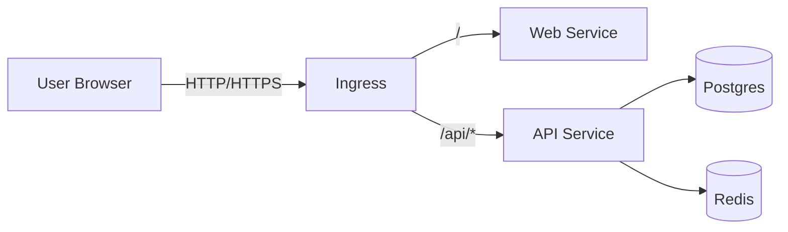

# Kubernetes Deployment (Helm)

PyToYa ships with a Helm chart at `helm/pytoya/` that deploys:
- NestJS API
- Next.js Web
- PostgreSQL
- Redis

## Architecture



## Build & Push Images

Build from the repo root (the Dockerfiles depend on the root `package-lock.json` / workspaces):

```bash
# API
docker build -t registry.dev.lan/pytoya/api:1.0.0 -f src/apps/api/Dockerfile . \
  --build-arg NODE_IMAGE=registry.dev.lan/<your-node-mirror>:18-alpine
docker push registry.dev.lan/pytoya/api:1.0.0

# Web (compile the API base URL into the frontend bundle)
docker build -t registry.dev.lan/pytoya/web:1.0.0 -f src/apps/web/Dockerfile . \
  --build-arg NEXT_PUBLIC_API_URL=/api
docker push registry.dev.lan/pytoya/web:1.0.0
```

Notes:
- `NODE_IMAGE` MUST point to your internal mirror of `node:20-alpine` (examples: `registry.dev.lan/library/node:20-alpine` or `registry.dev.lan/node:20-alpine`).

## Deploy with Helm

```bash
helm upgrade --install pytoya helm/pytoya \
  --namespace pytoya \
  --create-namespace \
  --set global.imageRegistry=registry.dev.lan \
  --set api.tag=1.0.0 \
  --set web.tag=1.0.0 \
  --set postgres.auth.password=change-me \
  --set secrets.jwtSecret=change-me \
  --set secrets.llmApiKey=change-me
```

## NodePort (No Ingress)

If you don't have (or don't want) an Ingress controller, you can expose Services via NodePort.

Notes:
- NodePorts expose your services on every node IP. Treat this as dev-only unless you lock it down.
- If you don't set `*.service.nodePort`, Kubernetes assigns a free port automatically.

### Dependencies Only (Postgres + Redis)

Helper script:

```bash
POSTGRES_PASSWORD=change-me ./scripts/deploy-deps-nodeport.sh
```

Manual Helm command:

```bash
helm upgrade --install pytoya-dev helm/pytoya \
  --namespace pytoya-dev \
  --create-namespace \
  --set global.namespace=pytoya-dev \
  --set api.enabled=false \
  --set web.enabled=false \
  --set ingress.enabled=false \
  --set postgres.service.type=NodePort \
  --set redis.service.type=NodePort \
  --set postgres.auth.password=change-me \
  --set secrets.jwtSecret=dummy \
  --set secrets.llmApiKey=dummy
```

Get the NodePorts:

```bash
kubectl get svc -n pytoya-dev
```

## Verify

```bash
kubectl get pods -n pytoya
kubectl get svc -n pytoya
kubectl get ingress -n pytoya
```

If you have an Ingress host configured, open:
- `https://<host>/` (web)
- `https://<host>/api/health` (api)
