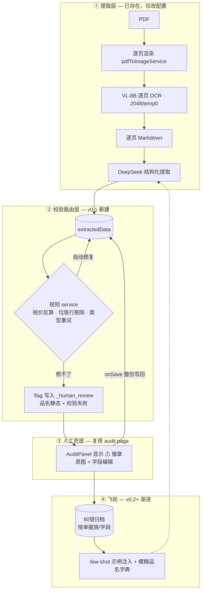

# 准确率演进设计文档

**日期**: 2026-08-02
**项目**: pytoya（采购单 OCR 提取）
**范围**: 基于双引擎验证实验（2026-08-02 全天）的全部证据，确定准确率演进路线。主路径最终收敛为 **"AI agent + skill 优化环"**（见"主路径"章节）；代码版 v0.1 降为归档备选路径（量大后的产品化方向）。
**前置文档**: `docs/superpowers/specs/2026-08-02-dual-engine-eval-design.md`（双引擎验证设计）、服务器产物 `/tmp/dual_eval/FINAL.md`、`/tmp/dual_eval/control_report.md`

## 背景与动机

- 初始假设：双引擎（VL + inference-OCR）+ 置信度路由（CorrectionPanel）是提升准确率的方向；远期通过微调 inference-OCR 追求 99%。
- 2026-08-02 全天实验（40 个固定 verified 样本、同一 GT、同一 compare 脚本、生产链路）系统检验了该假设及其替代方案。
- 结论：初始假设被实验否定；但实验同时测明了错误的真实构成，收敛出一条更便宜、更确定的演进路线。

## 实验证据链（决策日志）

所有数字经独立 reviewer 对服务器状态复算确认。样本：40 个固定 id（54,60,72,...,495），GT 来自 pytoya_restore 快照。

### 实验 1：双引擎 vs 单 VL 同批对照

| 指标 | A 双引擎 (group 19) | B 单 VL (group 20) |
|---|---|---|
| 完成率 | 34/40（6 个确定性 LLM 校验失败） | **40/40** |
| 配对 34 文档全字段准确率 | 68.3%（312/457） | 66.6%（295/443） |
| 配对差值 | +1.7pp（每样本胜负 11/10/13 ≈ 随机） | |
| VL 崩溃率（短输出/循环） | 0% | 0% |
| `_human_review` 命中 | 17/40 | 0/40 |

**结论：inference-OCR 对准确率边际贡献 ≈ 0；双引擎完成率反而更低**（6 个失败文档源 id 85,108,218,232,310,334 在单 VL 下全部完成——拼接 markdown 诱发 LLM 输出类型错误）。此前 68.3% vs 旧评估 D 范式 45.5% 的 +22.8pp 主要来自 VL 调用修复（多页共享 token 预算 → 逐页 2048，崩溃 67%→0%），而非 inference-OCR。

### 实验 2：错误分类（双引擎臂，34 文档）

| 字段 | 准确率 | 错误性质 |
|---|---|---|
| quantity / unit | 100% / 100% | — |
| unit_price_inc_tax / total | ~92% / ~96% | 接近达标 |
| po_no | 85.3% | 少量误读 |
| department.code | 73.5% | 小字误读 |
| items.length | 73.5% | **全部为 EXTRA 行**（模型过度生成；src199: GT 1 行 vs 预测 16 行，含 '3','4','5','6' 纯数字垃圾行） |
| unit_price_ex_tax | ~64% | **串列**：错误样本中 5-6/8 精确满足 pred = GT×1.13（模型把含税价填入不含税列） |
| invoice.usage | 8.8% | 手写自由文本（单字段占全部错误 ~21%） |
| items.name | ~24% | 手写型号误读/丢失（`φ8→3A`、`DZ20Y-225/3300` 丢失） |
| cost | ~39% | **疑似 GT 口径问题**：GT 为 2 位代码（02/12/20），模型输出单据上 5 位会计科目代码（72001/20601）或 None |
| invoice_date | 55.9% | 手写数字误读（用户确认日期非重要数据） |

格式类错误（空格/全半角）救援数 = 0：全部为真实识别错误。错误不集中于坏文档（最差 9/33），而是分散在难字段上。

### 实验 3：裁切放大 + 32B 探针（6 案例：3 日期 + 3 品名）

变体：V1 整页聚焦提问（8B）/ V2 裁切 4× 放大（8B）/ V3 裁切 4× 放大（32B）。结果：精确匹配 **1/6、1/6、0/6**。

**结论：裁切放大假设与 32B 假设均被否定。** 附带发现：(a) 2 个日期案例出现"所有变体一致 ≠ GT"（src136: GT 2025-02-22 vs 全模型 2025-12-22；src240: GT 2026-03-07 vs 2026-03-01）→ GT 污染证据；(b) src407 日期：生产链路给出 2020-09-03（幻觉级），同模型同图聚焦提问直接读对 → **聚焦提问机制有效**。

### 实验 4：聚焦重问（15 日期错误 + 10 品名错误，8B 整页）

- 日期修复率 **6/15（40%）**，另有多例接近修复（2016-03-01 → 2026-01-21，GT 2026-01-24）；
- 品名修复率 **0/10**（四种条件全部失效，确认手写品名为不可约残差）。

### 实验 5：朴素算术规则离线模拟（单 VL 臂，52 行）

规则 `|pred_ex − pred_inc|/pred_inc < 0.02 → ex := inc/1.13`：触发 20 次，**修 0 破 4**。
诊断：(a) 除以 1.13 的浮点结果与 GT 人工舍入值不匹配（需 round2 + 容差）；(b) 零税率行（ex≈inc 为真值）被误伤（需文档级守卫）。规则方向正确（×1.13 模式实证），形式需改进后重测。

### 调查 6：单模型逐字段质量（Arm B，n=40，严格精确匹配）

po_no **92.5%** · quantity **97.7%** · unit **100%** · total_amount_inc_tax **86.4%** · unit_price_inc_tax 79.5% · cost 56.8% · unit_price_ex_tax 43.2% · items.length 72.5% · department.code 70.0% · invoice_date 52.5% · items.name 18.2% · usage 10.0%。

**结论：单 VL-8B（逐页 2048/temp0）在数值核心字段已达 80-100%。** 旧评估"最高 45.5%、无范式可用"系多页共享 token 预算的脚本缺陷（崩溃率虚高 67%）所致。

### 调查 7：品名长尾性

40 文档 GT 共 61 个品名行，**61 个全部不重复（重复率 0%）**。纠错字典精确匹配不会快速饱和；品名人工残差为平坦永久量（约 1.2 个/单），不递减。

### 调查 8：生产修改日志（operation_logs）

- 587 条日志（2026-03-18 ~ 07-19）：human_verified 454、manual_edit 133（**157 条字段级 diff**，`{path, before, after}`，update-manifest.usecase 的 computeJsonDiff 自动生成）——**飞轮采集端已存在并在运行**。
- 纠正分布：unit_price_ex_tax **42（27%，与评估"串列"发现互证）** > name 30 > quantity/inc_tax/total 合计 53 > cost 13。
- **cost 口径终结**：样例 diff `items.1.cost: "2090015" → "15"`——单据上"采购主账号"列与部门代码相邻（原文 `20900|15`），模型连读成 `2090015`，人工还原主账号段。**属相邻列拼接错误，可用提示词规则修复**（已落地为 schema 14 规则 16，2026-08-03）。
- **警示**：quantity/含税价/合计在评估接近满分（97-100%）但生产被纠正 53 次 → 生产单据 mix 比 40 样本难（或存在行错位）；任何验收必须加生产单据重测，以 operation_logs 纠正率为基线。
- 结论：日志与飞轮之间只差两条读路径（检索注入 promptRulesMarkdown + 品名字典）；税价串列被人工重复纠正 42 次是"环未闭合"的直接证据。

### 约束核实

- VL 经 siliconflow API 调用，**不可微调**；DeepSeek 同为 API。唯一自持可训练模型 = inference-OCR（PaddleOCR，本地 onnx）。
- **无物料主数据 / 历史品名库**（用户确认）。
- 生产 schema 14 现状：entry config 仅 `{detail: high, prompt}`，合并行默认后实际 **maxTokens=4096、temperature=0.5**（合并顺序 `{...行config, ...entry config}`，text-extractor.service.ts:157）。验证过的稳定配置为 2048/temp0（崩溃率 0%）。
- 应用渲染 DPI = 72（pdf.imageScale 默认 1）；整页 DPI 对准确率的影响未测，用户决定不再压榨 VL 参数，搁置。

## 已确定结论

**否定（实验证据在上）：**
1. inference-OCR / 双引擎作为准确率杠杆（+1.7pp 噪声，完成率更差）；
2. 32B 替换 / 裁切放大级联（探针 1/6、0/6）；
3. CorrectionPanel 作为主校对 UI（其存在前提——OCR bbox + 置信度——随 1 被否定；且与既有 audit page 功能重复）；
4. 微调 VL 提准确率（API 不可微调）；
5. 无约束条件下手写品名 99% 全自动（长尾 + 物理性字迹信息丢失，对任何方案均不可达）。

**确认：**
1. 单 VL-8B + 逐页 2048/temp0 是稳定地基，数值核心 80-100%；
2. 错误按性质三分：结构性（串列、垃圾行）→ 确定性规则；注意力残差（部门代码、日期）→ 聚焦重问；物理性不可读（手写品名）→ 人工兜底；
3. 置信度路由思路成立，但信号源应为"结果站不站得住"（校验失败 / 自洽性不一致），而非"OCR 看得清不清"；
4. 人工校对 UI 落点 = 既有 ManifestAuditPage / AuditPanel（原图 + 字段编辑 + humanVerified 保存链路完整存在）。

## 目标与天花板

| 目标 | 可达性 | 路径 |
|---|---|---|
| 数值核心字段 99% 自动 | 可达 | 规则层 + 校验 + 聚焦重问 |
| 品名 99% 全自动 | 不可达（当前约束） | — |
| 品名 99% 有效准确率 | 可达 | 自动 best-effort（~20% 起）+ 每单 10-20 秒人工确认 |

## 最终架构



**长期路线图（每步独立交付价值，可随时停止）：**

- **v0.1**：配置 + 规则层 + flag 写入 + audit 徽章 → 数值 ~95%，系统可用；
- **v0.2**：纠错飞轮（few-shot 注入 + 模糊品名字典，API 兼容的"学习"形态，无需训练）；
- **v0.3**：聚焦重问 + 自洽性 diff（仅当 v0.1/v0.2 数据显示需要）→ 部门/po_no 残差；
- **v0.4（可选）**：微调 PaddleOCR 品名专用 rec（唯一可训练杠杆；仅当品名仍是瓶颈且飞轮数据充足）；VL 随 API 新模型发布做配置级升级（零工程）。

## 主路径：AI agent 优化环（skill 化）

用户确认（2026-08-03）：不建产品代码，优化层交给 AI agent，固化为项目 skill `.opencode/skills/pytoya-optimize/`。

**能力映射（对照代码版 v0.1）：**

| 代码版 v0.1 | agent 环替代形态 |
|---|---|
| 规则 service（税价/垃圾行） | agent 执行**确定性 SQL**（算术由 SQL 做，LLM 不猜数；先 preview 后事务执行） |
| 类型失败重试 | agent 扫描 failed → 调 re-extract API 重触发 |
| flag + 徽章 | agent 每轮生成"待审清单"，人拿清单去 audit page 改 |
| few-shot 飞轮 | agent 提炼纠错模式 → 生成 promptRulesMarkdown **diff 提案，人批准后才应用** |
| 品名字典 | agent 维护"易错品名表"写进 prompt 规则（top-k ≤ 20 条） |

**每轮流程**：扫描（新纠正/failed/待审字段）→ 确定性修复 → 提示词更新提案（需批准）→ 待审清单 → 轮次报告（/tmp/dual_eval/rounds/）。
**已接受的 trade-off**：批处理延迟（agent 跑完才生效，人审前数据本就不算数）；运行依赖 agent 定期启动；提示词容量需 top-k 精选。
**仍必须的一次性动作**：schema 14 配置 UPDATE（maxTokens 4096→2048、temperature 0.5→0）。
**数据基础**：既有 operation_logs（157 条 diff 起步，调查 8）。

## v0.1 详细设计（备选路径·归档：量大后的产品化方向；主路径见上节）

### 变更清单

| # | 变更 | 位置 | 规模 |
|---|---|---|---|
| 1 | schema 14 ocrExtractors[0].config 加 `maxTokens: 2048, temperature: 0` | DB 一条 UPDATE（回滚备份先行） | 零代码 |
| 2 | 规则 service（税价反算 + 垃圾行 + 类型重试） | 新增 `validation-rules.service.ts` + extraction.service 落库前一处调用 | ~100 行 + ~5 行接线 |
| 3 | flag 写入：品名静态 + 规则修不了 → `extracted_data._human_review` | 规则 service 内（同落点） | ~30 行 |
| 4 | AuditPanel ⚠ 徽章（读 `_human_review`，humanVerified=true 后隐藏）+ 列表未审核筛选（复用既有 humanVerified 筛选） | AuditPanel.tsx / ManifestsPage | 前端小改 |

**不动的部分**：提取主流程（extractMultiple / prompt-builder / worker）、API 接口、数据库表结构、CorrectionPanel（搁置保留）、crops.service（setNestedField bug 不在本路径，降级为可选卫生项）。

### 规则 1：税价列互算（容差版）

```
文档级守卫：若 ≥50% 行满足 pred_ex == pred_inc（精确相等）→ 判定零税率单据，整单跳过。
行级：若 pred_inc > 0 且 |pred_ex − pred_inc| / pred_inc < 0.02
      → pred_ex := round(pred_inc / 1.13, 2)
      修复动作写 validation_results（审计：rule='tax_column_swap', before, after）。
```
- 税率默认 0.13；后续可扩展为从单据检测（v0.2+）。
- **上线门槛**：40 样本离线模拟净修复为正且误伤 ≤1（朴素版修 0 破 4，容差版必须重测达标后才写代码）。

### 规则 2：垃圾行过滤

```
删除满足任一条件的 items 行：
- name 匹配 ^[\d.\-\s]+$（纯数字/符号，如 '3','4','5'）
- len(name.strip()) < 2
- 与前行 (name, quantity, unit_price_inc_tax) 全同（重复生成）
```
- 审计写 validation_results（rule='junk_row_filter', removed_count）。
- 离线验证：src199（GT 1 行 vs 预测 16 行）等 EXTRA 案例修复率；误删合法行 = 0。

### 规则 3：类型错误自修复重试

- DeepSeek 输出 schema 校验失败时，将具体报错（如 "/items/1/quantity: must be number"）回灌提示词重试 1 次；
- 仍失败 → 状态 failed 但保留已提取部分（需处理 `manifest_status_enum` 缺 'partial' 值的既有问题：加枚举值或走 completed + validation_results 标记，实现时二选一）。
- 目标：生产完成率 40/40（双引擎时代 34/40 的失败全属此类）。

### flag 写入与数据格式

提取 + 规则完成后，组装 `extracted_data._human_review`（沿用既有格式，生产者从 DeepSeek 换为规则 service）：

```jsonc
[
  { "field": "items[0].name", "page": 1, "ocr_text": "皮带轮（已磨）", "reason": "name_review" },
  { "field": "department.code", "page": 1, "ocr_text": "20521", "reason": "validation_failed:type" }
]
```

- 品名：所有 `items[i].name` 静态生成（永远进队列，无需置信度）；
- 校验失败：仅**修不了的**进队列（可自动修复的已修，不打扰人）；
- page 字段：audit page 展示整份单据，page 仅作信息字段（无 bbox 来源，不生成 crop）。

### 人工校对交互（全部既有接口）

1. 列表页按 humanVerified=false 筛选（既有能力）；
2. 打开单据 → AuditPanel 对 `_human_review` 中的字段显示 ⚠"机器不确定"徽章；
3. 人对照原图编辑/确认 → `onSave({extractedData, humanVerified: true})`（既有保存链路，整份写回，不触发 setNestedField 路径）；
4. humanVerified=true 后徽章隐藏（`_human_review` 数组保留作审计痕迹）。

### 配置变更（变更 1）

```sql
-- 回滚备份
SELECT validation_settings FROM schemas WHERE id=14; -- 存档
-- 应用
UPDATE schemas SET validation_settings = jsonb_set(
  validation_settings, '{ocrExtractors,0,config}',
  (validation_settings->'ocrExtractors'->0->'config') || '{"maxTokens": 2048, "temperature": 0}'
) WHERE id=14;
```
上线后监控：崩溃率（ocr_result page-0 markdown <100B / 循环检测）< 2%，完成率 ≥ 98%。

## 验证指标（v0.1 验收）

| 指标 | 门槛 |
|---|---|
| 税价规则离线净效果（40 样本） | 净修复为正，误伤 ≤1 |
| 垃圾行规则离线效果 | EXTRA 案例修复 ≥5/9，误删合法行 = 0 |
| v0.1 部署后 40 样本重提取：数值核心（量/单位/含税价/合计/po_no） | ≥ 90% |
| 完成率（含类型重试） | 40/40 |
| 所有完成样本产生品名 flag；AuditPanel 徽章可见；保存写回正确 | 全部通过 |
| 生产 schema 14 配置上线后 7 天崩溃率 | < 2% |

## 风险与未决项

| 项 | 状态 |
|---|---|
| cost 字段 GT 口径 | **已关闭**（调查 8）：相邻列拼接错误（采购主账号+部门代码连读），schema 14 规则 16 已落地修复 |
| 生产单据 mix 比 40 样本难（quantity/含税价生产纠正 53 次 vs 评估近满分） | 任何验收必须加生产单据重测 + 以 operation_logs 纠正率为基线 |
| GT 污染（src136/src240 日期、沙/纱同音字、src199 行数） | 日期按用户决定不修；品名同音字与行数 GT 建议抽暇裁决（影响基线数字可信度） |
| 税价规则容差参数（0.02 / 税率 0.13） | 离线模拟调参，以净效果为准 |
| 72dpi 渲染对品名的影响 | 用户决定搁置（不再压榨 VL 参数）；v0.4 前不重启 |

## 废弃方向存档（勿重走）

| 方向 | 否定证据 | 备注 |
|---|---|---|
| 双引擎 / inference-OCR 提准确率 | 配对 +1.7pp 噪声、完成率 34/40 < 40/40 | extractor 4ca3e9e3 的 serviceUrl 修改可回滚；schema 10 可用 /tmp/dual_eval/schema10_validation.json 恢复原状 |
| 32B 替换 | 探针 0/6，case2 反而更差 | 整页 32B 未测（用户决定不测，成本考量） |
| 裁切放大级联 | 探针 1/6（8B）、1/6（8B 裁切）、0/6（32B 裁切） | |
| CorrectionPanel 主校对路线 | 前提（OCR bbox+置信度）被否定；与 audit page 重复 | 代码搁置保留；pending-crops/verify/cropFromFile/BboxEditor 基础设施将来可被 VL grounding 复活为微任务加速器 |
| 微调 VL | API 调用，不可微调 | 唯一可训练模型为 PaddleOCR（v0.4 可选） |
| 物料字典快速饱和 | 61 品名 0% 重复（纯长尾） | 模糊匹配字典仍可由飞轮渐进积累（v0.2） |

## 产物索引

- 服务器 `/tmp/dual_eval/`：FINAL.md（结论）、control_report.md（A/B 矩阵）、report.md（双引擎矩阵）、gt_40.tsv、prod_40.tsv、prod_sv.tsv、id_map*.tsv、eval_compare.py、eval_paired.py、probe/（探针脚本与结果）、status.log（全程时间线）
- 本仓库 `.superpowers/sdd/`：各任务 implementer 报告与 reviewer 结论
