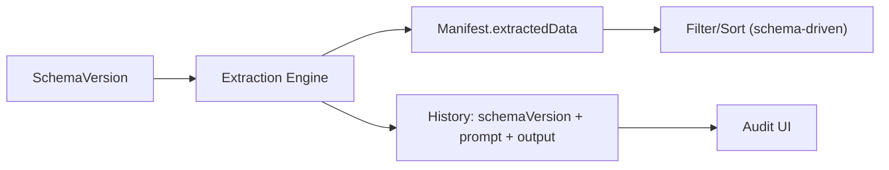

# Proposal: Add Architecture Policy (Schema-Driven, Generic, Audit-Safe)

## Why

We want PyToYa to behave like a **generic extraction + audit platform**:
- The system should not hardcode “invoice/receipt/contract” business rules in runtime code.
- Document shape, requiredness, and UI column selection should be driven by per-project JSON Schema and its extensions.
- Audit history must remain explainable and reproducible as schemas evolve.

Today, some “policy” decisions are implicit or inconsistent across layers (backend, filtering/sorting semantics, validation caching, and schema management). Making these explicit will reduce complexity and keep future refactors aligned.

### Root cause

We lack a single agreed set of **platform invariants** for:
- how project schemas evolve over time (versions + provenance)
- when “required field” checks should run (required is optional)
- how schema-driven list columns are used for query semantics (filter/sort)
- where domain constraints are allowed to live (schema/rules/scripts vs code)

## What Changes

This change is **policy + specification only** (no production code changes in this change):
- Define and document architecture policies in this proposal/design.
- Update OpenSpec requirements to reflect:
  - project ↔ schema contract (single active schema, versioned)
  - required fields are optional (skip missing-field checks when none are defined)
  - schema-driven filtering/sorting semantics are type-driven (no field-name business logic)
  - validation results/caches are tied to schema/script versions for audit clarity

## Goals
- Keep the platform generic (new document types should be configuration-first).
- Make extraction/audit reproducible (runs record schema/prompt provenance).
- Remove accidental business logic from backend defaults and query semantics.
- Provide a shared “rulebook” for future refactors and proposals.

## Non-Goals
- Implementing schema versioning, projection tables, or refactors in code (follow-up changes).
- Removing existing invoice-focused templates/examples immediately.
- Changing public APIs in this change.

## Architecture (Policy Summary)

**Platform/Core**
- OCR/text extraction, LLM execution, persistence, audit history, job orchestration

**Project Configuration**
- JSON Schema (+ supported `x-*` extensions)
- schema rules + validation scripts
- prompt templates (schema-scoped)

## Compatibility / Migration
- This change only updates requirements and documents policy.
- Follow-up implementation changes should be proposed separately and approved.

## Risks
- Risk of over-specifying: mitigate by keeping requirements focused and platform-level.
- Risk of conflict with existing changes: mitigate by keeping this as a policy baseline that other proposals can reference and align to.

## Validation Plan
- Run: `openspec validate add-architecture-policy --strict`

## Open Questions
- Schema version visibility: audit-only vs user-selectable rollback/pin for re-extract.
- Multi-document-type strategy:
  - one project per doc type (simpler) vs
  - one schema using `oneOf` + discriminator (more flexible).
- Retention policy for raw artifacts (PDF/OCR/prompt/response) vs privacy risk.

