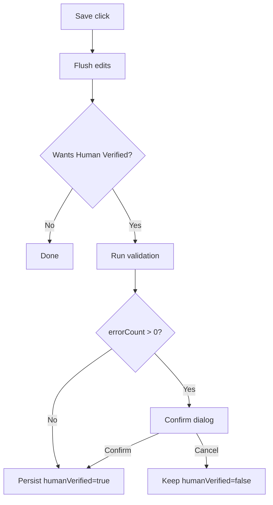

# Change: Add Audit “Human Verified” Validation Gate + Explicit Save

## Why

Today a manifest can be marked **Human Verified** without a mandatory validation step. This makes it easy to “certify” invoices that still have validation errors, which undermines the meaning of the Human Verified flag.

## Root Cause

- The audit form relies on **debounced auto-save**, so there is no single “commit point” to enforce a validation gate.
- Backend validation (`/validation/run`) validates **saved** `manifest.extractedData` (it only receives `manifestId`), so validating the user’s *current draft* requires a save step first.
- The current React Query invalidation for validation runs uses a different key than the manifest query, so updated validation results may not refresh reliably.

## What Changes

- Add an explicit **Save** button in the audit header.
- Gate saving `manifest.humanVerified=true` behind a validation run:
  - Save the latest edits first (without setting Human Verified).
  - Run validation.
  - If validation has **errors**, require user confirmation before persisting Human Verified.
  - If validation has **no errors**, persist Human Verified without prompting.
- Adjust the audit **Run validation** header button to show a result summary without forcing a tab switch (provide an optional “View” action to open the Validation section).
- Fix validation run query invalidation so the audit UI refreshes validation results consistently.

## UX (ASCII)

### Save as Human Verified

```
User intent: Human Verified = true

[Save] click
  -> Save latest edits (humanVerified stays false)
  -> Run backend validation
      -> PASS (0 errors) --------> Save humanVerified=true
      -> FAIL (>0 errors) -----> Confirm dialog
                                  [Cancel] keep humanVerified=false
                                  [Confirm] save humanVerified=true anyway
```

### Run validation (no forced navigation)

```
[▶ Run validation] click
  -> Run backend validation
  -> Toast summary: "2 errors • 1 warnings"  [View]
     (no tab switch unless user clicks View)
```

## Architecture (Mermaid)



## Impact

- Affected specs: `web-app`, `validation-scripts`
- Affected code (expected):
  - `src/apps/web/src/shared/components/manifests/AuditPanel.tsx`
  - `src/apps/web/src/shared/components/manifests/EditableForm.tsx`
  - `src/apps/web/src/shared/hooks/use-validation-scripts.ts`
  - `src/apps/web/src/shared/hooks/use-modal-dialog.tsx` (reuse)
- Dependencies: none (no new production dependencies)
- Breaking changes: behavior change in the audit flow (saving Human Verified now requires validation + possible confirmation)

## Non-Goals (v1)

- Validate unsaved drafts without persisting first (would require a new backend “preview validation” endpoint that accepts extractedData).
- Run validation scripts in the browser (security + parity concerns).
- Redesign the full audit auto-save model (keep changes minimal and focused on the Human Verified gate).

