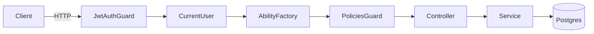

# Change: add-casl-access-control

## Why

The backend currently relies on partial role checks and scattered ownership checks. Several endpoints are **JWT-only** and allow any authenticated user to perform admin-like actions (queue control, schema CRUD, extractor CRUD) or read cross-project data (validation scripts / job history), and some endpoints return configuration objects that may contain secrets.

This is a security and correctness risk even in “mostly single-user” deployments because:
- the codebase already models **admin/user** roles, so “JWT-only” ≠ “authorized”
- background processing and shared/global resources (queue, schemas, extractors) need consistent access rules

## What Changes

- Introduce **CASL-based authorization** for NestJS API using a centralized `AbilityFactory` and a `PoliciesGuard`.
- Define a small set of standard actions (e.g., `read`, `create`, `update`, `delete`, `manage`) and subject types (Project, Group, Manifest, Schema, ValidationScript, Job/Queue, Extractor, Model).
- Enforce **admin-only** access for global/admin surfaces (queue controls, job listing, extractors management, schema catalog if global).
- Enforce **ownership/tenant** access for project-scoped resources (projects, groups, manifests, validation scripts, schema-rules).
- Mask **secret fields** in extractor configuration payloads similarly to model parameter masking.

Non-goals (explicitly out of scope for this change):
- Making “untrusted JS sandboxing” safe purely via Node `vm` (requires a bigger architectural decision).

## Root Cause (Observed)

- Controllers using `@UseGuards(JwtAuthGuard)` without:
  - `RolesGuard` for admin-only surfaces, or
  - an ownership check / policy evaluation for project-scoped data.
- DTO mapping for extractors returns `config` directly and does not mask secrets.
- Validation scripts “list all” path does not scope by user/project.

## Proposed Architecture

Mermaid (request authorization flow):



ASCII (resource enforcement idea):

```
              +-------------------+
HTTP request ->| JwtAuthGuard      |
              +---------+---------+
                        |
                        v
              +-------------------+        +-------------------+
              | PoliciesGuard     |------->| AbilityFactory    |
              +---------+---------+        +-------------------+
                        |
                        v
              +-------------------+
              | Controller/Service|
              +-------------------+
```

## Implementation Notes (Pseudo-code)

Ability definition:
```
defineAbility(user):
  if user.role == admin:
    can(manage, all)
  else:
    can(read, Project, { ownerId: user.id })
    can(manage, Group,    { project.ownerId: user.id })
    can(manage, Manifest, { group.project.ownerId: user.id })
    can(manage, ValidationScript, { project.ownerId: user.id })
    # global resources:
    cannot(manage, Queue)
    cannot(manage, Extractor)
    cannot(manage, Schema)   # if schemas are global/admin-managed
```

Guard usage:
```
@CheckPolicies((ability) => ability.can('manage', 'Queue'))
@UseGuards(JwtAuthGuard, PoliciesGuard)
POST /api/jobs/queue/pause
```

## Impact

- Affected specs:
  - `openspec/specs/auth/spec.md` (authorization semantics beyond role-only)
  - `openspec/specs/validation-scripts/spec.md` (script listing scoping + access)
  - Potentially `openspec/specs/projects/spec.md` (ownership invariants made explicit)
- Affected code:
  - API guards/decorators, several controllers (schemas, extractors, queue, jobs, validation)
  - DTO mapping for extractor responses (secret masking)

## Rollout / Compatibility

- This change is behavior-changing: requests that were previously “JWT-only” will become **403 Forbidden** unless authorized by role/policy.
- Provide clear error codes/messages for policy denials where needed.

