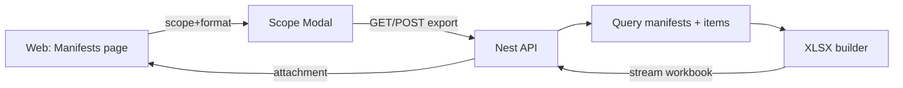

# Proposal: Add Export as Excel (.xlsx)

## Why

Users export manifest data for review, sharing, and offline analysis. CSV works, but it is painful for:
- multi-tab exports (manifests + items),
- typed values (numbers/dates), and
- large datasets where users want filters/pivots without manual cleanup.

### Root cause

Export is currently **CSV-only** and **row-shape-limited** (single flat file). This blocks a “spreadsheet-native” experience where:

```
Manifests (1 row per manifest)  +  Items (1 row per item)
             ^                           ^
      stable columns                detail table
```

## What Changes

### UX (recommended)
- Keep the existing Manifests list “scope confirmation modal” pattern.
- Add a **Format** choice: `CSV` or `Excel (.xlsx)`.
- For Excel, export a workbook with:
  - `Manifests` sheet: 1 row per manifest (metadata + extracted fields)
  - `Items` sheet: 1 row per item, joined by `manifest_id` (and `task_path`)
  - Optional `Meta` sheet: export timestamp + scope + filter/sort snapshot

### API
- Add endpoints symmetrical to CSV export:
  - `GET /api/manifests/export/xlsx` (filtered export via query params)
  - `POST /api/manifests/export/xlsx` (selected export via `{ manifestIds: number[] }`)
- Use attachment download with correct content type and filename.

### Data shape (recommended)
- Prefer “safe text” for identifiers with leading zeros (e.g., PO numbers).
- Avoid formula injection by writing user-controlled values as **string cells** (never formula cells).

## Goals
- Users can export the same scope (filtered/selected) as CSV today, but as `.xlsx`.
- Excel export supports fast analysis (pivots, filters) without manual preprocessing.
- Export remains consistent with the existing batch-scope modal UX.

## Non-Goals
- Full styling / rich Excel formatting (colors, conditional formats).
- Perfect schema-agnostic “array explosion” for every possible schema (beyond `items`).
- Adding new production dependencies without explicit confirmation.

## UX Flow

```text
Manifests List
  -> Export (toolbar)
    -> Scope Modal (existing)
       - Scope: Filtered (default) / Selected
       - Format: CSV / Excel (.xlsx)    [NEW]
       - Export
         -> download starts
         -> success OR error shown in modal
```

## Architecture



## Implementation Notes (pseudocode)

### Web (existing modal + format)
```text
open modal
scope = filtered(default) | selected
format = csv(default) | xlsx

if user clicks Export:
  ids = (scope==selected) ? selectedIds : fetchFilteredIds()
  call GET/POST /manifests/export/{format}
  trigger browser download
```

### API (xlsx)
```text
if selected:
  manifests = fetchByIds(owner=user, ids)
else:
  manifests = fetchByFilters(owner=user, filters)

workbook = new Workbook()
addSheet("Manifests", buildManifestRows(manifests))
addSheet("Items", buildItemRows(manifests))
addSheet("Meta", buildMeta(filters/sort/scope))

return stream(workbook) with content-disposition filename
```

## Compatibility / Sequencing
- This proposal is designed to reuse the same scope semantics as CSV export.
- It should remain compatible with the active change `refactor-csv-export-schema-driven`:
  - Preferred: share a common “tabular export rows” layer so both CSV and XLSX formatters consume the same rows.

## Risks
- **Large exports**: `.xlsx` generation can be memory-heavy; mitigate with row limits + streaming writer.
- **User expectations**: “Excel” can imply formatting; set expectations (data-first workbook).

## Production Dependency (recommended)

**Recommendation**: use `exceljs` with its streaming XLSX writer.

Why this choice:
- Supports streaming writes (important for memory safety on large exports).
- Widely used in Node backends for `.xlsx` generation.

Alternatives considered:
- `xlsx` (SheetJS community): solid writer, but streaming/large-file ergonomics are weaker; also more footguns around typing/formatting.
- `xlsx-populate`: nice API, but tends toward in-memory workbooks (riskier for large exports).

**Approval gate**: this is a new production dependency; do not add it until explicitly approved.

## Validation Plan
- Specs: update deltas for `excel-export` and `web-app`, then run `openspec validate add-excel-export --strict`.
- Web tests: batch-scope modal + format selection + download trigger.
- API tests: endpoint auth/ownership, content-type/filename, row counts, and safe-cell handling.

## Open Questions
- Should the UI label be “Export” (single entry) or “Export CSV / Export Excel” (two actions)?
- Do we want a `Meta` sheet in v1, or keep it minimal?
