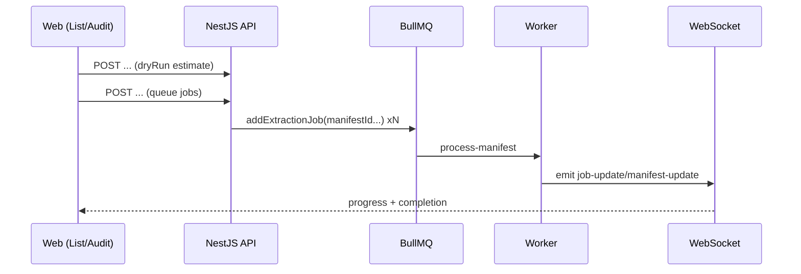

# Change: Add Filtered Bulk Extraction + Audit “Extract…” Action

## Why

Users need a safe, obvious way to run extraction for:
- a **selected** set of manifests
- the **current filtered result set** (across pages)

Today users can only trigger extraction one-by-one (row menu) and there is no “Extract…” action in the audit header.

## Root Cause

- Web UI has a batch button but it is a stub (`handleBatchReExtract`) and does not call the bulk extraction API.
- Audit panel has no “Extract…” button, so users must leave the audit flow to re-run extraction.
- Backend bulk extraction API requires explicit `manifestIds`, but the UI’s “current filters” are not directly actionable without collecting IDs across pages.
- Cost estimation currently depends on having OCR available; bulk extraction endpoints may process OCR before estimating/queuing.

## What Changes

### Web (Manifests List)

- Add a single **Extract…** action that opens a modal and lets the user choose:
  - **Scope**
    - Selected manifests (N)
    - All matching current filters (Total = `meta.total`) **(default)**
  - **Behavior**
    - Completed manifests: Skip (default) / Re-extract (overwrite extracted data)
    - Processing manifests: **Always skip by default** / Force include (explicit user choice)
- Show a clear notice (what will happen) and an explicit confirmation step including:
  - manifest count
  - estimated cost range + currency (via `dryRun`)
  - warning that extraction updates extracted data and queues jobs

### Web (Audit Panel)

- Add an **Extract…** button in the audit header to trigger extraction for the current manifest.

### API (Recommended)

- Add a filtered bulk extraction endpoint so the server resolves “current filters” without the web app fetching IDs across pages.
- Support `dryRun` for estimation (count + cost) and “run” for queueing jobs.

## UX (ASCII)

### List page

```
Selected: 12     [Export CSV] [Validate] [Extract…]

Extract manifests (modal)
  Scope:
    ( ) Selected (12)
    (•) All matching current filters (2431)

  Behavior:
    Completed:   (•) Skip   ( ) Re-extract
    Processing:  (•) Always skip   ( ) Force include

  Notice:
    - Queues background extraction jobs
    - May run OCR if missing
    - Updates extracted fields on completion
    - Track progress in Jobs panel

  Estimated cost: $12.30–$18.90 USD
  [Cancel] [Start extraction]
```

### Audit panel

```
[←] [→]  [Save] [Validate] [Extract…] [Sections ▼] [X]
```

## Pseudocode

```ts
// shared helper (web)
async function confirmAndExtract(scope, behavior) {
  const estimate = await api.extractFilteredOrBulk({ scope, behavior, dryRun: true });
  const ok = await confirm(`${estimate.manifestCount} manifests, cost ${estimate.min}-${estimate.max} ${estimate.currency}`);
  if (!ok) return;
  const started = await api.extractFilteredOrBulk({ scope, behavior, dryRun: false });
  seedJobsPanel(started.jobIds);
}
```

## Architecture (Mermaid)



## Impact

- Affected specs: `web-app`, `extraction` (and reuses `manifest-filtering` semantics)
- Expected code touch points:
  - Web: manifests list batch actions, audit header actions, modal + i18n
  - API: filtered bulk extraction controller/service + DTO
- Dependencies: none (no new production dependencies)
- Breaking changes: none expected (additive feature), but users will have new “Extract…” flows

## Non-Goals (v1)

- Implementing advanced “extract only missing fields” or partial extraction strategies.
- Redesigning the extraction workflow or job processor.
- Long-running batch orchestration beyond existing BullMQ job-per-manifest model.
