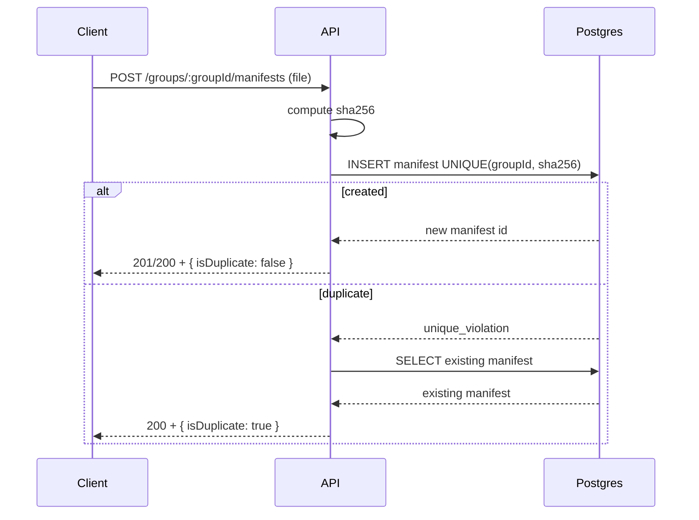

# Design: Duplicate Detection for Manifest Uploads

## Goal

Prevent creation of duplicate manifests when the same PDF file is uploaded multiple times to the same group, while keeping UX friendly and race-safe.

## Duplicate Key

- Compute `sha256` of the uploaded file bytes.
- Treat duplicates within the scope of a group:
  - key = `(groupId, contentSha256)`

## Data Model

- Add `manifests.content_sha256` (nullable).
- Add a uniqueness constraint/index for `(group_id, content_sha256)` to prevent races.
  - Prefer a partial unique index where `content_sha256 IS NOT NULL` so old rows can remain null.

## API Behavior (High Level)

- Single upload: `POST /groups/:groupId/manifests` (and alias endpoint)
  - On new file: create manifest, return manifest with `isDuplicate=false`
  - On duplicate: return existing manifest with `isDuplicate=true`
- Batch upload: `POST /groups/:groupId/manifests/batch`
  - Return one response item per uploaded file, each including `isDuplicate` so the UI can summarize.

## Pseudocode

```text
createManifest(user, groupId, file):
  require file exists
  sha = sha256(file.bytes)
  existing = find manifest where groupId and contentSha256 = sha
  if existing:
    return existing with isDuplicate=true

  try:
    manifest = create + save with contentSha256=sha
    store file (or move to final location)
    return manifest with isDuplicate=false
  catch unique_violation(groupId, sha):
    existing = find manifest where groupId and contentSha256 = sha
    return existing with isDuplicate=true
```

## UX Warning Pattern

```text
Upload complete: Created N, duplicates M.
[Review duplicates] -> list of duplicated files with "Open existing" actions
```



