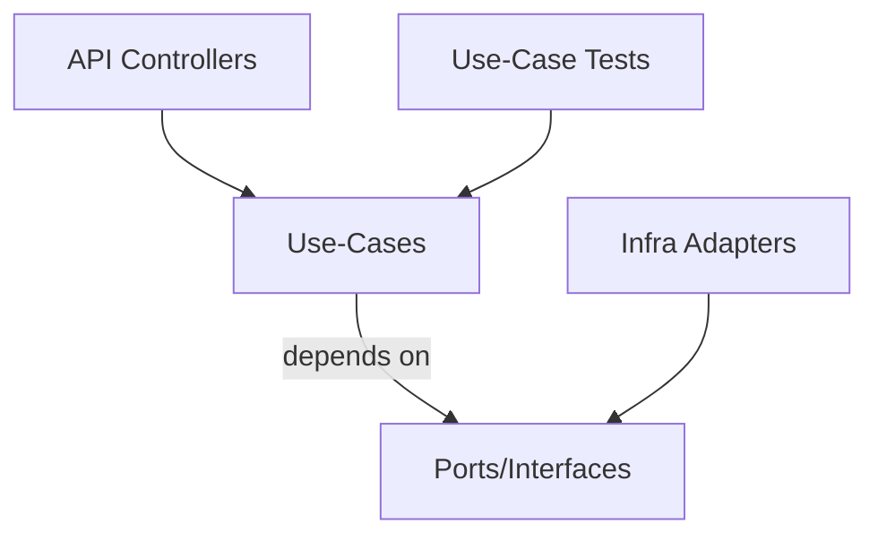
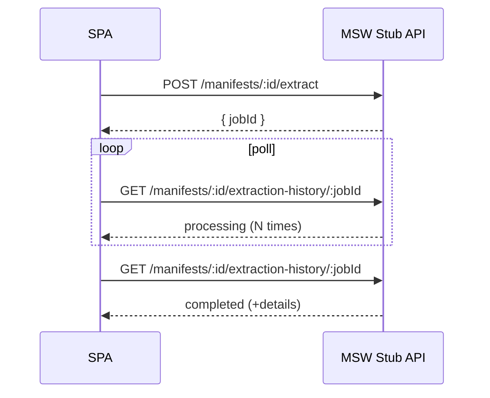

# Design: Use-Case Testing Framework

## Goals
- Maximize business-rule coverage for “most user journeys”
- Keep tests fast and deterministic (no Postgres, no BullMQ, no browser)
- Minimize test boilerplate (“less click/type”)
- Keep API/web tests thin and stable

## Layer names (recommended)

- **Unit tests**: pure helpers and small functions
- **Use-case tests**: workflow-level business logic, no HTTP/UI/DB/queue
- **API wiring tests**: controllers + guards + DTO validation + mapping only
- **Web journey tests**: route-level UX flows with MSW stubs

## Directory sketch (proposal-level)

```
src/apps/api/src/
  usecases/
  ports/
  adapters/            # existing modules can provide adapters via DI
  test/
    usecases/
      fixtures/

src/apps/web/src/
  e2e/                 # journey tests (RTL + MSW)
  tests/
    mocks/
      scenarios/
```

## Core architecture



## Deterministic async (no BullMQ)

### Principle
Replace “background work” with a deterministic runner in tests:

```
enqueue job -> runner executes -> emits progress -> updates state
```

### Port shape (example)
```text
interface JobQueue {
  enqueue(job): JobId
}

// test-only helper:
queue.runAll()
queue.runNext()
```

## Web journeys: polling over websocket

### Principle
In journey tests, simulate progress via polling endpoints (MSW state machine).
WebSocket is mocked to avoid brittle timing.



## “Less typing” test DSL

### Target ergonomics
```text
actor = env.user('admin').project('p1').group('g1')
manifest = actor.upload('fixtures/invoice-a.pdf')
job = actor.extract(manifest.id)
env.queue.runAll()
actor.audit(manifest.id).set('invoice.po_no','0000009').save()
actor.expect(manifest.id).toBeHumanVerified(false)
```

### Rules
- Keep DSL thin: it should wrap setup/fixtures, not hide core assertions.
- Prefer table-driven scenarios over many near-duplicate tests.

