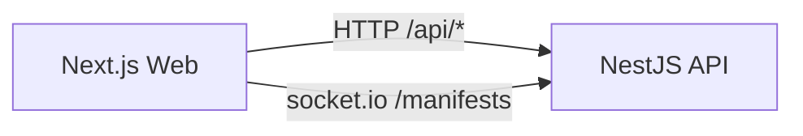

# Proposal: Standardize API `/api` Prefix and Align Web ↔ API Contracts (Option A)

## Why
The repo currently has inconsistent assumptions about the backend API base path and several REST endpoints:
- Docs/tests/helm commonly assume `/api/*` routes to the backend.
- The NestJS API does not mount controllers under `/api` today.
- The web app mixes `/api` and non-`/api` base URLs depending on environment, and uses a different token source for WebSockets than for HTTP.

This causes broken local/dev deployments, confusing configuration, and failing TypeScript/Jest validation when we try to enforce quality gates.

## What Changes
- Mount REST endpoints under `/api/*` and keep WebSocket under `/manifests`.
- Add compatibility routing and REST aliases for legacy paths used by the web app.
- Normalize web client API/WS base URLs and token usage to one source of truth.

## Root Cause
Mismatch between **specs/docs/tests** and **implementation**:
- `openspec/specs/kubernetes/spec.md` expects ingress routing `/api/*` to backend (no rewrite specified).
- Web defaults and tests frequently include `/api`, but Docker Compose sets `NEXT_PUBLIC_API_URL` without `/api`.
- WebSocket client reads `localStorage['auth_token']`, while HTTP auth uses the persisted Zustand store.
- Several frontend API calls target endpoints that do not exist in the API (upload, extraction trigger, export selected).

## Goals (Option A)
- Make the backend accept and serve canonical REST routes under `/api/*`.
- Keep local and k8s configurations consistent with that contract.
- Align web HTTP + WebSocket auth token usage to a single source of truth.
- Provide compatibility aliases for legacy routes when practical.

## Non-Goals
- Redesigning the extraction engine or job processor internals beyond what’s needed to pass `fieldName` for re-extraction.
- Introducing new production dependencies.
- Broad UI/UX changes.

## Architecture (after change)


## Proposed Behavior Summary
### Canonical routing
- REST: `http(s)://<api-host>/api/*`
- WebSocket namespace: `http(s)://<api-host>/manifests` (no `/api` prefix)

### Canonical env var semantics
- `NEXT_PUBLIC_API_URL` SHOULD be the API origin (scheme+host+port) or full base URL.
- The web app MUST normalize it to a REST base that ends with `/api`.

Pseudocode:
```text
raw = env.NEXT_PUBLIC_API_URL ?? 'http://localhost:3000'
apiBase = raw endsWith '/api' ? raw : raw + '/api'
wsBase = env.NEXT_PUBLIC_WS_URL ?? stripSuffix(apiBase, '/api')
token = useAuthStore.getState().token
```

## Compatibility / Migration
- Prefer **backwards compatibility** for a deprecation window by accepting both:
  - canonical `/api/*`, and
  - legacy `/*` for existing clients (via server-side rewrite middleware), excluding `/uploads` and WebSocket paths.
- Provide REST endpoint aliases where the web app already expects different paths (upload, export selected, extraction trigger).

## Risks
- **Breaking changes** if some clients depend on non-`/api` routes and we do not provide a compatibility layer.
- **Ingress rewrite ambiguity**: k8s ingress may or may not rewrite paths; spec will clarify “no rewrite required”.
- **WebSocket CORS/origin mismatch** if defaults are not updated (dev ports differ).

## Validation Plan
- Backend: `npm run test --workspace=@pytoya/api` (focused), plus workspace tests if needed.
- Frontend: `npm run test --workspace=@pytoya/web`, `npm run type-check --workspace=@pytoya/web`.
- Repo-wide: `npm run lint` (non-interactive).
- Manual smoke:
  - Web can log in, list projects (`GET /api/projects`), and receive WS progress updates.
