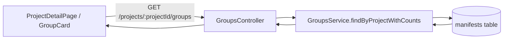

# Change: Add Completed Manifest Counting to Group Status Indicators

## Why

Today, group cards show status counts for **pending**, **errors**, and **verified**, but they do not include a count for manifests that have **completed** extraction.

This makes it hard to answer a common question at the group level:
- “How many invoices are done extracting (completed), but still not human verified?”

## Root Cause

- `GET /projects/:projectId/groups` is backed by `GroupsService.findByProjectWithCounts()`.
- The aggregation currently computes `pending`, `failed`, and `verified` (via `humanVerified=true`), but it does not compute `completed`, so the UI has no completed count to display.

## What Changes

- Add `statusCounts.completed` to the group list response for each group.
- Update the GroupCard status indicators to display the completed count alongside pending, errors, and verified.
- Keep semantics explicit:
  - `completed` maps to `manifest.status="completed"`
  - `verified` maps to `manifest.humanVerified=true`

## UX (ASCII)

```
Group A
  12 manifests
  pending:   2
  errors:    1
  completed: 9
  verified:  4
```

## Implementation (Pseudo-code)

```
for group in project.groups:
  pending   = count(manifests where groupId=group.id and status='pending')
  failed    = count(manifests where groupId=group.id and status='failed')
  completed = count(manifests where groupId=group.id and status='completed')
  verified  = count(manifests where groupId=group.id and humanVerified=true)
  return statusCounts { pending, failed, completed, verified }
```

## Architecture (Mermaid)



## Impact

- Affected specs: `web-app`
- Affected code (expected):
  - API: `src/apps/api/src/groups/groups.service.ts`, `src/apps/api/src/groups/dto/group-response.dto.ts`
  - Web: `src/apps/web/src/shared/components/GroupCard.tsx` (and related styles/i18n)
  - Shared types: `src/shared/src/types/projects.ts` consumers (via `@pytoya/shared/types/projects`)
- Dependencies: none
- Breaking changes: none intended (additive response field + additive UI indicator)

## Non-Goals

- Adding “processing” counts to the group card (out of scope unless requested).
- Redesigning the group card layout or navigation behavior.
- Changing the meaning of “verified” (remains `humanVerified=true`).

