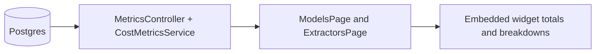

# Change: Add multi-currency cost dashboard (LLM + text extractor)

## Why
Today we have cost tracking, but cost visibility is fragmented:
- The UI shows some cost summaries, but a unified “token cost dashboard” does not exist.
- Some UI widgets assume USD (hard-coded `$`) and/or accidentally treat mixed-currency totals as `0`.
- The existing `/api/metrics/dashboard` response does not carry currency and the backend aggregates costs without grouping by currency, which can silently misrepresent totals when multiple currencies exist.

This makes it hard to answer practical questions like:
- “How many tokens did we spend this week, and what did it cost?”
- “Which model is most expensive per 1k tokens?”
- “How much of total spend is text extraction vs LLM?”
- “What is the spend by currency when projects use different pricing currencies?”

## Root cause (current behavior)
### 1) Backend currency is ignored in dashboard metrics
- `GET /api/metrics/dashboard` returns plain numeric totals without currency.
- The aggregator sums `job.actualCost` across all jobs without grouping by `job.costCurrency`, so multi-currency data is mixed into a single number.

### 2) Frontend assumes dollar formatting in dashboard widgets
- Some dashboard pages render totals as `${number}` and compute totals using `null` totals as `0`, which is misleading when totals are intentionally `null` for mixed currencies.

## Scope
- **In scope**:
  - Add a reusable embedded cost dashboard widget in `src/apps/web` (no new route).
  - Add/extend metrics endpoints in `src/apps/api` to provide currency-aware aggregates for the dashboard (LLM + text).
  - Reuse existing UI patterns for `totalsByCurrency` and cost formatting (currency code display).
  - Fix existing dashboard widgets that assume `$` for totals.
- **Out of scope**:
  - FX conversion (no converting currencies into a single grand total).
  - Repricing historical usage using “latest price” rules.
  - New external metrics/BI dependencies.

## Goals
- Provide an embedded view to answer:
  - Total spend **by currency**
  - LLM token usage (input/output/total) and cost-per-1k tokens **by currency**
  - Text extraction usage (pages processed) and cost-per-page **by currency**
  - Breakdown by model and by extractor
  - Simple date range filtering
- Ensure multi-currency is never silently summed into one number.
- Keep changes small and consistent with existing DTO patterns (`totalsByCurrency`).

## Proposed changes
### 1) Add currency-aware cost dashboard metrics endpoint (API)
Add `GET /api/metrics/cost-dashboard` (date-range optional) that returns:
- Totals grouped by currency
- Time series grouped by date and currency
- Breakdowns grouped by model (LLM) and extractor (text)

Proposed response shape (DTO sketch):
```ts
type CostDashboardTotalsByCurrency = {
  currency: string; // e.g. "USD" | "CNY" | "unknown"
  documentCount: number;
  totalCost: number;
  textCost: number;
  llmCost: number;
  pagesProcessed: number;
  llmInputTokens: number;
  llmOutputTokens: number;
};
```

Proposed endpoint contract (sample JSON):
```json
{
  "dateRange": { "from": "2026-01-01", "to": "2026-01-31" },
  "totalsByCurrency": [
    {
      "currency": "USD",
      "documentCount": 42,
      "totalCost": 12.3456,
      "textCost": 2.1,
      "llmCost": 10.2456,
      "pagesProcessed": 300,
      "llmInputTokens": 120000,
      "llmOutputTokens": 24000
    },
    {
      "currency": "CNY",
      "documentCount": 5,
      "totalCost": 18.5,
      "textCost": 3.0,
      "llmCost": 15.5,
      "pagesProcessed": 60,
      "llmInputTokens": 22000,
      "llmOutputTokens": 4000
    }
  ],
  "costOverTime": [
    {
      "date": "2026-01-13",
      "currency": "USD",
      "totalCost": 0.25,
      "textCost": 0.05,
      "llmCost": 0.2,
      "pagesProcessed": 6,
      "llmInputTokens": 900,
      "llmOutputTokens": 180
    }
  ],
  "llmByModel": [
    {
      "llmModelId": "uuid-llm-1",
      "llmModelName": "gpt-4o",
      "currency": "USD",
      "documentCount": 42,
      "llmCost": 10.2456,
      "llmInputTokens": 120000,
      "llmOutputTokens": 24000,
      "costPer1kTotalTokens": 0.0711
    }
  ],
  "textByExtractor": [
    {
      "extractorId": "uuid-extractor-1",
      "extractorName": "PaddleOCR-VL",
      "currency": "USD",
      "documentCount": 42,
      "textCost": 2.1,
      "pagesProcessed": 300,
      "costPerPage": 0.007
    }
  ]
}
```

### 2) Embed Cost Dashboard widget in existing pages (Web)
Add a reusable cost dashboard widget component and embed it in:
- `/models` (LLM-focused widget)
- `/extractors` (Text-focused widget)

Widget responsibilities:
- Date range picker
- Totals rendered **per currency** (no mixed-currency grand total)
- Small breakdown table (top models / top extractors)

### 3) Reuse dashboard patterns for text extractor + LLM
Design the dashboard UI around a shared “usage series” pattern:
```
Usage = (quantity in natural units) + (cost) + (currency)
LLM: quantity = tokens (in/out)
Text: quantity = pages
```

### 4) Fix existing pages that hard-code USD formatting
Replace `$...` totals with the existing `totalsByCurrency` rendering pattern (one line per currency) in:
- Models dashboard spend widget
- Extractors page “Total Spend”

## Route decision
- No new global route is added in this change.
- Existing pages `/models` and `/extractors` gain an embedded multi-currency cost widget.
- Existing per-project costs page remains at `/projects/:id/settings/costs` (scoped cost summary).

## Design notes
### Simple pseudocode (currency-safe aggregation)
```
for each row in source (jobs/manifests):
  currency = row.currency ?? "unknown"
  totals[currency].totalCost += row.totalCost
  totals[currency].textCost += row.textCost
  totals[currency].llmCost += row.llmCost
  totals[currency].pagesProcessed += row.pagesProcessed
  totals[currency].llmInputTokens += row.llmInputTokens
  totals[currency].llmOutputTokens += row.llmOutputTokens
```

### ASCII flow
```
Postgres (jobs, manifests)
  -> NestJS /api/metrics/cost-dashboard (group by currency)
       -> Web ModelsPage and ExtractorsPage (render totalsByCurrency)
```

### Mermaid (runtime view)


## Acceptance criteria
- Cost dashboard shows totals grouped by currency and never displays a single mixed-currency “grand total”.
- LLM section shows input/output tokens and cost per 1k tokens per model (grouped by currency).
- Text section shows pages and cost per page per extractor (grouped by currency).
- Existing `$` hard-coding is removed from dashboard spend widgets and replaced with currency-code display.
- No new production dependencies are added.

## Risks / mitigations
- **Risk**: queries become expensive on large job tables.
  - **Mitigation**: require/encourage date range filtering; aggregate with grouped SQL; add indexes only if data shows a need.
- **Risk**: missing currency data in historical rows.
  - **Mitigation**: normalize to `unknown` currency and keep it visible to avoid silent mixing.
