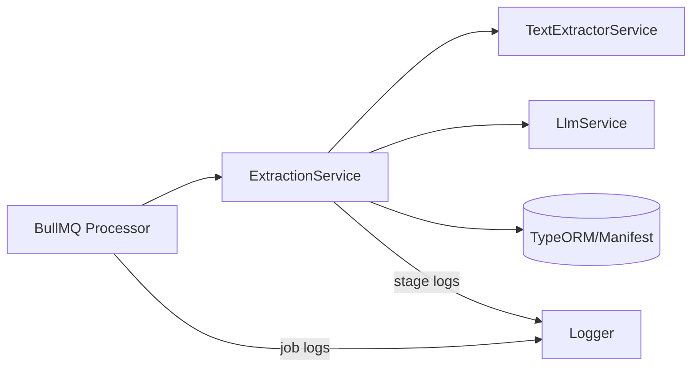

# Change: Add extraction stage boundary logs (TypeScript API only)

## Why
When extraction fails today, it is difficult to pinpoint **which stage** failed (validate / OCR / LLM / parse / schema validate / save) because logs are not consistently emitted at stage boundaries and errors often lose stack/context. This increases MTTR and makes production incidents hard to debug.

## What Changes
- Add stage boundary logs in `ExtractionService` for `VALIDATING`, `TEXT_EXTRACTING`, `EXTRACTING`, and `SAVING`.
- Improve BullMQ worker failure logs in `ManifestExtractionProcessor` to include attempts/progress and stack traces when available.
- Add a regression test asserting stage failure logging.
- Add troubleshooting docs describing the new log lines and mention `server.logLevel`.

## Scope
- **In scope**: `src/apps/api` (NestJS) extraction pipeline + BullMQ worker logs.
- **Out of scope**: Python CLI (`main.py` and `src/workflow/*`), frontend UI changes, new logging libraries.

## Goals
- Provide consistent, low-noise logs that answer:
  - **Where** did it fail? (stage name)
  - **What** input/job was it? (manifestId, jobId)
  - **How long** did the stage take? (durationMs)
  - **What** was the retry context? (retryCount, missingFields count)
  - **What** is the stack? (error.stack when available)
- Preserve existing backend constraint: **Nest `Logger` only** (see `openspec/specs/backend-standards/spec.md`).

## Non-goals
- Switching to structured logging frameworks (pino/winston).
- Logging full OCR text / prompt text in application logs (too large + potentially sensitive).
- Changing extraction behavior, retries, or validation semantics.

## Proposed changes
### 1) Stage boundary logs in `ExtractionService`
Emit start/end/failure logs for the key stages:
- `VALIDATING`
- `TEXT_EXTRACTING` (OCR)
- `EXTRACTING` (LLM + parse + schema validation)
- `SAVING`

Each log line includes compact context:
- `manifestId`
- `jobId` (if present)
- `stage`
- `durationMs` (for end/fail)
- `extractionRetryCount`
- `missingFieldsCount` (when validation fails)

### 2) Improved worker failure logs in `ManifestExtractionProcessor`
When a job fails, log:
- jobId, manifestId, attemptsMade, lastProgress
- error message **and** stack (when available)

### 3) Log level behavior (no new config keys)
- Stage boundary logs use `Logger.log()` (info-level).
- More detailed diagnostics (optional) use `Logger.debug()` and are therefore controlled via existing `server.logLevel`.

## Design notes
### Simple pseudocode (intended structure)
```
logStageStart(stage, ctx)
t0 = now()
try:
  runStage()
  logStageEnd(stage, ctx, durationMs)
catch err:
  logStageFail(stage, ctx, durationMs, err.stack)
  throw err
```

### ASCII flow (where stage logs sit)
```
BullMQ Worker(jobId)
  -> ExtractionService(manifestId)
       VALIDATING
       TEXT_EXTRACTING
       EXTRACTING (retry loop)
       SAVING
```

### Mermaid (runtime view)


## Acceptance criteria
- When extraction fails, logs include a single clearly identifiable line that contains `stage=<...>` plus `manifestId` and (when present) `jobId`.
- Worker failure logs include stack trace when error is an `Error`.
- Added logs do not include full OCR markdown, prompt content, or secrets.
- Tests are updated/added to prevent regressions (at least one test asserting stage failure logging).

## Risks / mitigations
- **Risk**: log noise in high-throughput environments.
  - **Mitigation**: keep payload small; deeper data stays `debug`.
- **Risk**: accidental sensitive data in logs.
  - **Mitigation**: whitelist-only context fields; no raw content logging.
