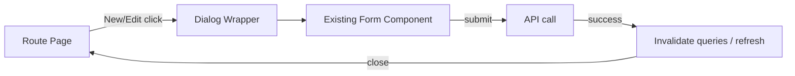

# Design: Modal-Based Create/Edit Standard

## Goal

Make create/edit flows predictable and “stay-in-context” by standardizing on modal dialogs.

## Modal Types

- **Centered dialog**: short forms, quick edits (simple inputs).
- **Side-sheet dialog**: long forms and editor-like screens (schema/prompt/scripts).

## Routing Rule

```text
Route page: deep-link + refresh-safe “editing” mode needed (example: Manifest audit)
Modal: no deep-link needed, keep list/detail context
```

## Architecture (wiring)



## Dirty Close Behavior

Pseudocode:
```text
onOpenChange(nextOpen):
  if nextOpen == false and form.isDirty and !isSubmitting:
    if userConfirmsDiscard:
      close()
    else:
      keepOpen()
  else if nextOpen == false and isSubmitting:
    keepOpen()
  else:
    setOpen(nextOpen)
```

## Recommended Defaults

- Dialog content height: `max-h-[90vh]` with internal scroll for long content
- Focus behavior: rely on `Dialog` focus trap + return focus to trigger
- Close controls: `Cancel` button always present; `X` close optional but must respect dirty confirm

