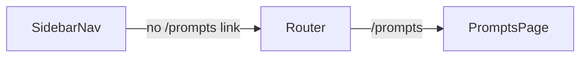

# Change: Remove unused `PromptsPage` route (web)

## Why

`PromptsPage` is currently reachable at `/prompts` but is not linked from the dashboard sidebar navigation. This creates a hidden UI surface area that adds maintenance cost, creates confusion (“is this feature supported?”), and increases the chance of drifting/untested behavior over time.

## Root Cause

Navigation was simplified (sidebar link removed), but the router entry and page component remained.

Evidence (current repo state):
- Sidebar nav items do not include `/prompts`: `src/apps/web/src/shared/components/SidebarNav.tsx:17`
- Router still registers the route: `src/apps/web/src/app/router.tsx:87`

Related prior/ongoing work:
- Archived plan that mentioned removing or restricting the page: `openspec/changes/archive/2026-01-17-add-project-wizard/proposal.md:37`
- Active change that still references `PromptsPage` for UI work: `openspec/changes/improve-create-edit-modals/tasks.md:7`

## What Changes

- Remove the `/prompts` route from the web router.
- Remove `PromptsPage` and its now-unused frontend prompt CRUD client code (API wrapper, hook, tests, MSW handlers if unused).
- Keep backend prompt endpoints intact (`/api/prompts`), since this change is web-UI cleanup only.

## Non-Goals

- Removing backend prompt support, database tables, or API endpoints.
- Replacing prompt template management UI with a new page/location (can be a follow-up proposal if desired).

## Current vs Proposed (Routing)

```text
Current:
  SidebarNav (no link)   Router has /prompts  -> PromptsPage

Proposed:
  SidebarNav (no link)   Router no /prompts   -> NotFound / fallback
```



## Implementation Sketch (pseudocode)

```text
if router has route("prompts"):
  delete route("prompts")

delete PromptsPage + related frontend modules
delete/update tests that assert prompts route/page exists
```

## Impact

- Affected specs: `web-app`
- Affected code (expected):
  - `src/apps/web/src/app/router.tsx` (remove route + import)
  - `src/apps/web/src/routes/dashboard/PromptsPage.tsx` (remove page)
  - `src/apps/web/src/routes/dashboard/PromptsPage.test.tsx` (remove tests)
  - `src/apps/web/src/api/prompts.ts` (remove unused API client)
  - `src/apps/web/src/shared/hooks/use-prompts.ts` (remove unused hook)
  - `src/apps/web/src/app/router.test.tsx` (remove prompts-route assertions)
  - `src/apps/web/src/tests/mocks/handlers.ts` (remove prompts handlers if unused)

## Breaking Changes

- Direct navigation to `/prompts` (e.g., bookmarks) will stop working.

## Risks / Trade-offs

- If any admin workflow relies on direct URL access to `/prompts`, this removes that capability without replacement.
- The active change `improve-create-edit-modals` contains a task for `PromptsPage`; this proposal should either supersede that task or re-scope it.

## Acceptance Criteria

- `PromptsPage` is no longer shipped in the web bundle (no route + no imports).
- Navigating to `/prompts` does not render a prompts CRUD UI.
- Web test/lint/type-check passes after implementation (`npm run test`, `npm run lint`, `npm run type-check`).
- `openspec validate remove-prompts-page --strict` passes.

## Open Questions

- Do we want to keep prompt template CRUD in the web app (but move it under a discoverable admin settings area), or is prompt management intentionally “internal only” going forward?

