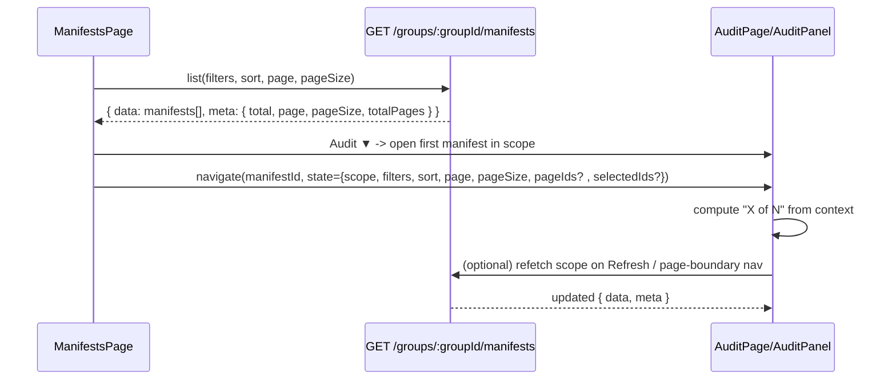

# Design: Audit navigation scope, counts, refresh

## Goal
Make the audit panel’s navigation count match user expectations by showing position within the current scope (filtered/all), and provide a reliable way to refresh that scope.

## Key Idea
Treat the audit experience as operating on a **navigation scope**:
- **Filtered**: same filters/sort the user is viewing on ManifestsPage
- **Selected**: explicit set of manifest IDs selected from ManifestsPage (ordered deterministically)
- **All**: same as Filtered but with empty filters
- **Unknown**: deep link without list context

The audit header uses scope metadata to display:
- `absoluteIndex = (page - 1) * pageSize + indexInPage + 1`
- `total = meta.total` for the current scope

## Data Flow (Mermaid)


## Refresh-safe behavior
The existing spec says the audit page is deep-linkable and refresh-safe.
To keep the new scope UX useful after browser refresh, use:
- Primary source: `location.state`
- Best-effort fallback: `sessionStorage` (keyed by `projectId + groupId`)
- Final fallback: `Unknown scope` (disable prev/next and refresh)

## Scope entrypoints (ASCII)
```
ManifestsPage
  Batch actions: [Extract ▼] [Audit ▼]

Audit ▼
  - Audit filtered results (N)
  - Audit selected (K)        (only if K>0)
  - Audit all in group (M)
```

Opening behavior:
```
if scope=Filtered: open first manifest from current list query order
if scope=All: open first manifest from unfiltered list query order
if scope=Selected: open first manifest in deterministic order (e.g., current list order)
```

## Pseudocode
```
indexInPage = pageIds.indexOf(currentManifestId)

if scopeKnown && indexInPage >= 0:
  absolute = (page - 1) * pageSize + indexInPage + 1
  label = `${absolute} of ${total} (${scope})`
else:
  label = `—`

onRefresh():
  refetch list query for (scope, filters, sort, page, pageSize)
  update total + pageIds

onNext():
  if indexInPage < pageIds.length - 1: goto(pageIds[indexInPage + 1])
  else if page < totalPages: fetch(page + 1) then goto(firstId)
```

## Risks / Tradeoffs
- `location.state` is not preserved on browser refresh; the sessionStorage fallback reduces surprise.
- If filters change in the background (e.g., status updates), the current manifest may no longer match the filtered scope; the audit page should keep the current manifest open but clearly indicate scope changes when refreshed.
