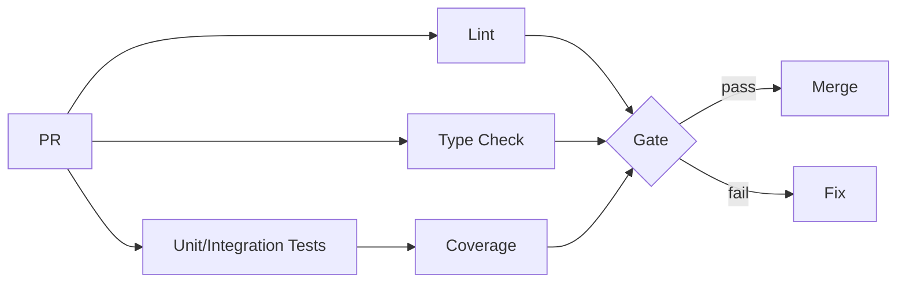

# Change: Improve Web Testing Coverage (and Web App Code Quality Gates)

## Why

Coverage is a proxy metric for confidence, but code quality improves only when the checks are:
1) targeted at high-risk code paths, and
2) enforced consistently (especially in CI).

Today, the web app has uneven test coverage and some gaps in high-impact surfaces (routing/layout, shared components, API client modules). Separately, the repo does not clearly enforce web quality gates in CI (coverage thresholds, lint, type-check), which makes regressions more likely and refactors riskier.

### Root cause

The feedback loop is not “closed”:

```
Write code -> Run tests locally (optional) -> PR -> Merge
                  ^ missing enforced gates ^
```

So even with a growing test suite, quality is limited by:
- critical areas still untested, and
- missing CI enforcement for the minimum quality bar.

## What Changes

This change upgrades web app code quality primarily via test coverage + CI gates, without adding new production dependencies.

### 1) Close coverage gaps in high-impact areas
- Route components: `RootLayout.tsx`, `router.tsx`
- Shared components: `ExtractionStrategySelector.tsx`, `ExtractionProgress.tsx`
- API modules: improve low-coverage modules (e.g., `manifests.ts`, `schemas.ts`)
- Replace placeholder tests (where practical) with reliable unit/integration coverage

### 2) Add/standardize test ergonomics (maintainability)
- Provide frontend test factories (web-specific) so tests don’t re-invent brittle fixtures.
- Keep MSW handlers and render helpers as the primary way to test API + React Query behavior.

### 3) Enforce web quality gates in CI
- CI MUST run:
  - `npm run test:coverage`
  - `npm run lint`
  - `npm run type-check`
- CI MUST fail if the web app falls below the minimum coverage thresholds.

## Architecture (quality gates)



## Impact

- Affected specs: `testing` (frontend testing standards)
- Affected code: `src/apps/web/src/routes/`, `src/apps/web/src/shared/hooks/`, `src/apps/web/src/shared/components/`, `src/apps/web/src/api/`
- Dependencies: No new external dependencies (using existing Vitest, React Testing Library)
- Breaking changes: None

## Current State

- Test suite exists, but coverage is uneven in a few critical files.
- CI enforcement for coverage/lint/type-check is not clearly present or not yet configured.

## Target State

- Web quality is enforced by default (CI gates).
- Minimum coverage thresholds are met and sustained.
- High-risk UI surfaces (routing/layout, shared components, API modules) have stable tests.

## Non-Goals
- Adding new production dependencies.
- Re-architecting application code; this change is about quality gates and tests.
- Writing exhaustive tests for everything; focus is high-signal coverage and reliability.
