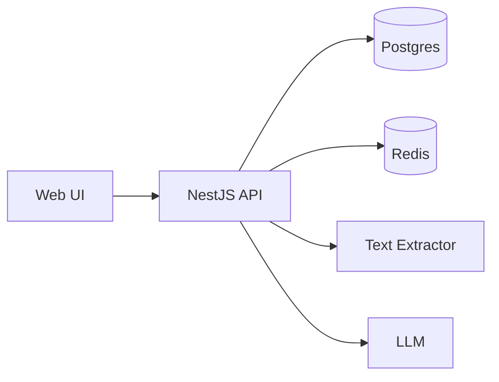

# Design: Refactor Extraction Runtime

## Goals
- Make extraction workflow easy to understand and test (named stages, shared state).
- Make progress/status emission consistent and owned by one component.
- Keep Phase A behavior stable (no API/schema changes).
- Enable Phase B topology changes without rewriting core logic.

## Non-Goals
- Redesigning the extraction prompts, schemas, or provider integrations.
- Changing REST endpoints or WebSocket payload shapes in Phase A.
- Introducing new production dependencies without explicit approval.

## Current Architecture

ASCII:
```
Web UI
  | HTTP /api/*
  v
API process (REST + WS + Worker)
  |-> Redis (BullMQ)
  |-> Postgres
  |-> uploads/ (local disk)
  |-> OCR + LLM
```



## Proposed Architecture

ASCII:
```
Web UI
  | HTTP /api/*
  v
API (REST only) ----> Queue (Redis/BullMQ) ----> Worker (background)
  ^                                         |
  | socket.io                               v
WS Gateway <---- shared event bus ----> Postgres/OCR/LLM

Uploads: shared storage (RWX PVC or object storage)
```

```mermaid
flowchart LR
  UI[Web UI] --> API[REST API]
  UI <--> WS[WebSocket Gateway]
  API --> Q[Queue (Redis)]
  Q --> W[Worker]
  W --> PG[(Postgres)]
  W --> OCR[Text Extractor]
  W --> LLM[LLM]
  W --> EVT[(Event Bus)]
  WS --> EVT
```

## Extraction Runtime (Phase A)

### Stage pipeline
The extraction workflow is represented as a pipeline of named stages.

Pseudocode:
```text
state = init(manifestId, jobId, options)

state = stage("LOAD", state) {
  load manifest, project, schema, prompt config
}

state = stage("TEXT_EXTRACT", state) {
  ensure OCR cache; run selected text extractor when needed
}

state = stage("LLM_EXTRACT", state) {
  build prompts; call LLM; capture usage/cost
}

state = stage("VALIDATE", state) {
  required fields + schema rules + custom validation scripts
}

state = stage("PERSIST", state) {
  write extracted data + costs + history records
}

stage("EMIT", state) {
  publish final job/manifest updates
}
```

### Progress/event publishing
One component owns realtime updates. Other components report “facts” (progress %, state transitions), but do not directly emit to sockets.

Pseudocode:
```text
publish(kind, jobId, manifestId, status, progress, extras)
  progress = clamp(0..100)
  progress = max(progress, lastProgress[jobId])   # monotonic
  emit(job-update)
  if kind == extraction:
    emit(manifest-update)
```

## Scale Readiness (Phase B)

### WebSocket strategy options
- Option 1 (simple): dedicated WS deployment + single replica (sticky and stable).
- Option 2 (scale): shared adapter/event bus (Redis adapter or app-level pubsub).

### Upload storage options
- Option 1: RWX PVC (shared filesystem) for uploads.
- Option 2: object storage (S3-compatible) with signed URLs (bigger change).

### Worker topology options
- Option 1: single process (current) for single-node deployments.
- Option 2: separate worker process/deployment that runs BullMQ processors only.
