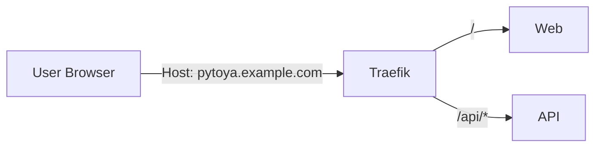

# Design: Host-based routing only

## Decision
Support **host-based** deployments only. Do not support serving the app under a URI prefix (subpath) like `/pytoya`.

## Rationale
- Reduces routing complexity across web, API, Helm, and Docker images.
- Avoids SPA edge cases (asset URLs, hard redirects, deep-link refresh).
- Matches common public internet patterns: one app per hostname.

## Target routing contract
### Same-host (recommended default)
- Web: `https://pytoya.example.com/`
- API: `https://pytoya.example.com/api/*`

### Separate hosts (optional)
- Web: `https://pytoya.example.com/`
- API: `https://pytoya-api.example.com/*`
  - Web is built with `VITE_API_URL=https://pytoya-api.example.com`

## Non-goals
- Runtime prefix injection (rewriting HTML/JS responses).
- Supporting both host + subpath simultaneously.

