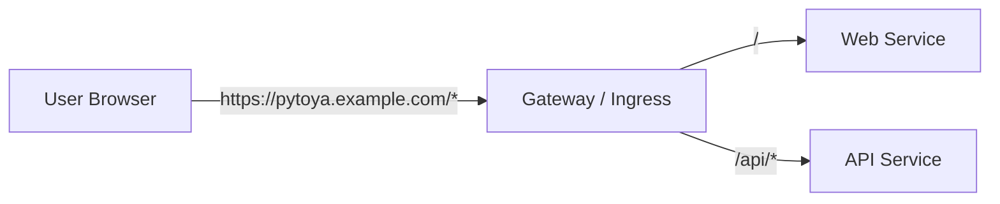

# Proposal: Remove subpath (URI prefix) deployment support

## Why
Subpath deployments (example: serving the app under `/pytoya`) add ongoing complexity across:
- Web build outputs (Vite `base`, React Router `basename`, hard redirects)
- API routing (base path + global `/api` prefix)
- Helm chart templates (path rules, health paths, config injection)
- Docker static serving (path rewrites/fallback behavior)

For simple multi-app deployments, using **hostnames** (example: `pytoya.example.com`) is simpler, more reliable, and matches common internet deployment patterns.

## What changes
### Behavior (breaking)
- The system WILL NOT support being hosted under a configurable base path like `/pytoya`.
- The supported deployment pattern will be **host-based**:
  - Web served at `/` on its host
  - API served under `/api` on the same host (or via a separate API host with an absolute `VITE_API_URL`)

### Removed configuration
- Web: `VITE_BASE_PATH`
- Helm: `global.basePath`
- API runtime config: `server.basePath`

### Updated components
- Helm chart templates remove base-path path rule logic and basePath injection into API config.
- Web app removes base-path utilities and assumes root hosting.
- API removes base-path routing helpers and assumes root hosting.
- Docker web image removes `serve.json` rewrite generation.

## Architecture (before/after)

Before (subpath):
```
https://gateway.example.com/pytoya/        -> web
https://gateway.example.com/pytoya/api/*   -> api
```

After (host-based):
```
https://pytoya.example.com/     -> web
https://pytoya.example.com/api  -> api
```



## Implementation notes (pseudocode)
Remove the base-path layer and keep only the stable `/api` prefix:
```
web.basePath = ""           // remove VITE_BASE_PATH
router.basename = ""        // root-hosted SPA
api.globalPrefix = "/api"   // keep
helm.ingress.webPath = "/"  // keep
helm.ingress.apiPath = "/api"
```

## Impact
- **Breaking** for any deployment using `/pytoya` (or any non-empty base path).
- Docs and Helm values referencing base path will be removed/updated.
- Existing OpenSpec change `fix-manifests-contract-basepath-ocr-errors` becomes obsolete and should be archived/closed once this change is approved.

## Migration path
1) Assign a hostname (domain/subdomain) for the web app, e.g. `pytoya.example.com`.
2) Route that host to the PyToYa Ingress.
3) Build the web image with:
   - `VITE_API_URL=/api` (same-host) OR `VITE_API_URL=https://api.example.com` (separate host)
4) Remove any `VITE_BASE_PATH` build args and any `global.basePath` Helm values.

## Alternatives considered
- Keep subpath support (status quo): higher complexity + ongoing bug surface area.
- Support both host + subpath: requires more tests, more docs, and duplicated routing logic.
- Runtime “prefix injection”: brittle HTML/JS rewriting; not recommended.

