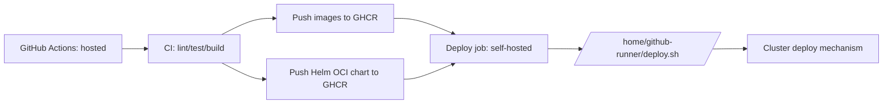

# Design: GHCR + Deploy Signal

## Architecture

### ASCII overview
```
hosted runner (ubuntu-latest)
  - lint/type-check/test
  - build+push images -> ghcr.io
  - package+push chart -> ghcr.io (OCI)
          |
          | outputs: chart_version, images JSON
          v
self-hosted runner (linux)
  - /home/github-runner/deploy.sh ... (signal)
          |
          v
deployment system (node-owned)
  - pulls from GHCR
  - applies to Kubernetes (or forwards to Lightway)
```

### Mermaid


## Deploy Script Contract

### CLI signature (stable public contract)
`/home/github-runner/deploy.sh --app <app> --chart oci://ghcr.io/<ORG>/charts/<chartId> --chart-version <version> --images '<json>'`

Examples:
```bash
/home/github-runner/deploy.sh \
  --app pytoya \
  --chart oci://ghcr.io/ORG/charts/pytoya \
  --chart-version 0.1.0-abcdef123456 \
  --images '{"api":"ghcr.io/ORG/pytoya/api:abcdef123456","web":"ghcr.io/ORG/pytoya/web:abcdef123456"}'
```

### `--chart` validation
Only OCI references under GHCR are accepted by contract.

Validation rule (internal):
- `--chart` MUST start with `oci://ghcr.io/`
- `--chart` MUST match `oci://ghcr.io/<ORG>/charts/<chartId>`

### `--images` schema
Required keys:
- `api`
- `web`

Optional keys:
- `worker` (defaults to `api` image in current Helm values if omitted)

Values:
- SHOULD be full image refs including tag: `ghcr.io/ORG/pytoya/api:<tag>`
- MAY be digest refs: `ghcr.io/ORG/pytoya/api@sha256:<digest>` (requires Helm chart support if used for `image:` rendering)

## Implementation Pseudocode

### Workflow-side (simplified)
```
if event is PR:
  run lint/typecheck/tests only
else if push to protected branch or tag or manual:
  build+push images to GHCR
  package+push chart to GHCR (OCI)
  on self-hosted runner:
    call deploy.sh with (app, chartId, chartVersion, imagesJson)
```

### `deploy.sh` (signal + validation)
```
parse args: app, chart, chartVersion, imagesJson
validate:
  - chart starts with oci://ghcr.io/
  - imagesJson is valid JSON
  - images.api and images.web exist
forward/apply:
  - either call local helm logic
  - OR send to Lightway/local deploy controller
return:
  - nonzero exit on failure
```

## Security Constraints
- Deploy job MUST NOT run for `pull_request`.
- The workflow SHALL NOT modify runner host settings (no `/etc/hosts`, no insecure registry config).
- Runner-local auth is the only auth for GHCR/Kubernetes in production deployments.
