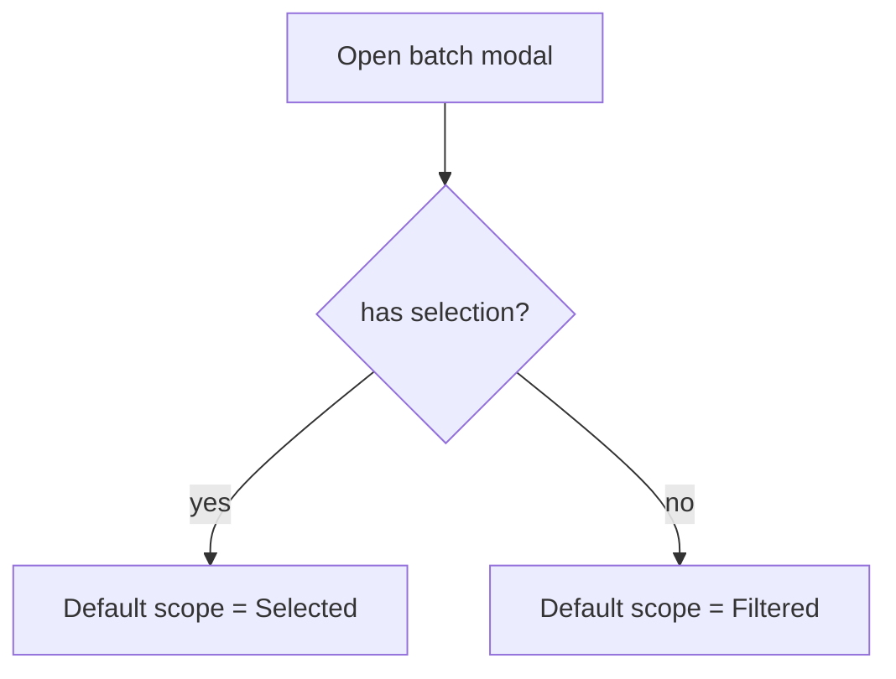

# Change: default-batch-scope-to-selection

## Why

When users select manifests and then trigger a batch action (export/validate/extract/delete), the modals default to “Filtered scope” instead of “Selected scope”. This is surprising and increases the risk of running an action on more manifests than intended.

This is a UX/business logic issue: selection is an explicit user intent signal and should be the default.

## Root Cause

- `ExtractFilteredModal` uses `defaultScope = 'filtered'` even when there is a selection.
- `ManifestBatchScopeModal` sets scope to `filtered` by default (when filtered scope is enabled).

ASCII:
```
User selects 3 rows
Clicks Export
Modal defaults to "Filtered (e.g. 500)"
=> user might export wrong scope
```

## What Changes

### A) Default scope to “Selected” when selection exists

Rules:
- If `selectedIds.length > 0`, default scope to `selected`
- Else default to `filtered` (when enabled)

Pseudocode:
```
hasSelection = selectedIds.length > 0
defaultScope = hasSelection ? 'selected' : 'filtered'
```

Mermaid:


## Impact

- Affected specs:
  - `openspec/specs/web-app/spec.md` (batch action default scope)
- Affected code (implementation later):
  - Web: `src/apps/web/src/shared/components/manifests/ExtractFilteredModal.tsx`
  - Web: `src/apps/web/src/shared/components/manifests/ManifestBatchScopeModal.tsx`

## Non-goals

- Adding new bulk endpoints (handled elsewhere).

