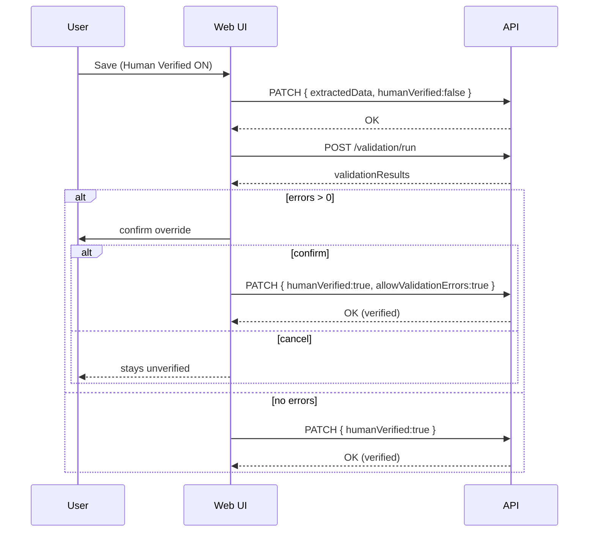

# Change: fix-audit-ux-flows

## Why

Three user-facing flows currently behave in a confusing or broken way:

1) **Human Verified**: the UI offers “confirm to verify anyway” when validation has errors, but the API always rejects `humanVerified=true` when errors exist. Users confirm and still get a failure.
2) **Manifests list live progress**: the list page registers websocket handlers but does not subscribe to per-manifest rooms, so progress bars can remain stale.
3) **OCR preview highlighting**: “Highlight Low Confidence” highlights short lines, not confidence. This misleads users.

## Root Cause

### 1) Human Verified mismatch
- UI flow: save draft → run validation → confirm → set `humanVerified=true`.
- Backend rule: reject `humanVerified=true` if `validationResults.errorCount>0`.

ASCII:
```
UI: confirm override exists
API: override not supported
=> user confirmation can't succeed
```

### 2) List progress not updating
- Server emits to `manifest:<id>` rooms.
- Audit page subscribes to a manifest room.
- List page does not subscribe for visible manifest IDs.

### 3) OCR highlight is not confidence-based
- Raw text view is line-split string; no per-line confidence is used.
- Toggle currently highlights `line.length < 10` (a heuristic), but label says “low confidence”.

## What Changes

### A) Make Human Verified flow consistent

Add an explicit API override flag for the *second* save call:
- `PATCH /manifests/:id` with `{ humanVerified: true, allowValidationErrors: true }` is allowed **only** when user explicitly confirmed in UI.
- Keep current strict default when the flag is absent.

Pseudocode:
```
if body.humanVerified == true:
  if validation.errorCount > 0 and body.allowValidationErrors != true:
    reject 400 MANIFEST_VALIDATION_FAILED
  else:
    allow set humanVerified=true
```

Mermaid (target flow):


### B) Make manifest list show real-time progress

Subscribe to visible manifests in the list:
```
on render page manifests [ids...]:
  subscribe ids...
on page change/unmount:
  unsubscribe old ids...
```

### C) Make OCR highlighting truthful

Replace misleading “low confidence” labeling with one of:
- hide the toggle when confidence data is not available, or
- rename toggle to “Highlight suspicious lines (heuristic)” and describe the heuristic.

We will implement the minimal truthful option first (no false claim).

## Architecture Notes

```mermaid
flowchart LR
  Worker -->|emit to manifest:<id>| WS[Socket.IO]
  Audit[Audit page] -->|subscribe-manifest(id)| WS
  List[Manifests list] -->|subscribe visible ids| WS
```

## Impact

- Affected specs:
  - `openspec/specs/web-app/spec.md` (audit save UX, manifests list progress, OCR preview labeling)
  - `openspec/specs/manifest-upload/spec.md` (update manifest semantics for humanVerified override flag)
- Affected code:
  - Backend: `UpdateManifestUseCase` / shared DTO types
  - Web: `AuditPanel`, `ManifestList`, `OcrPreviewModal`

## Non-goals

- Redesigning the validation engine, queue architecture, or OCR confidence extraction.
- Adding new dependencies.

