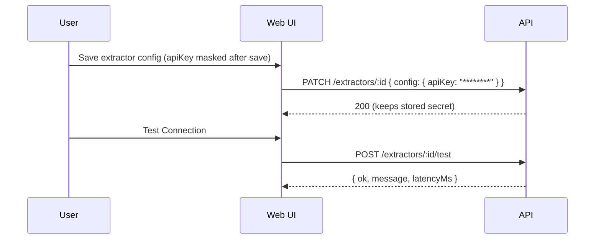

# Change: mask-extractor-secrets

## Why

Extractor configurations can contain API keys (e.g. `apiKey` for PaddleOCR / Vision LLM). Today, the Extractors API returns extractor `config` as-is. This risks leaking secrets to any authenticated client and makes “masked secret UX” impossible to implement reliably.

Users still need a way to **recheck** whether a secret is correct early. The correct UX is **Test Connection**, not “reveal stored secret”.

## Root Cause

- `ExtractorResponseDto` currently returns `config: entity.config ?? {}` without masking.
- Extractor types already declare which params are secret via `TextExtractorRegistry` metadata (`paramsSchema` has `secret: true`).

ASCII:
```
DB stores config.apiKey = "sk-live-..."
GET /api/extractors -> returns config.apiKey (plaintext)
=> secret leak
```

## What Changes

### A) Mask extractor secrets in all read responses

For `GET /api/extractors` and `GET /api/extractors/:id`:
- Any config key whose `paramsSchema[key].secret === true` MUST be returned as `********`.
- Plaintext secrets MUST NOT be returned in API responses.

Pseudocode:
```
schema = registry.get(extractor.extractorType)?.metadata.paramsSchema
masked = { ...config }
for each (key, def) in schema:
  if def.secret && key in masked:
    masked[key] = "********"
return masked
```

### B) Preserve stored secrets on update when client sends masked placeholder

For `PATCH /api/extractors/:id`:
- If `config` includes a masked placeholder (`********`) for a secret field, the backend keeps the existing stored secret.
- If extractor type changes (or no stored value exists), the backend MUST require the actual secret value (not `********`) when the schema requires it.

Pseudocode:
```
MASK="********"
if input.config provided:
  for secret field in schema:
    if input.config[field] == MASK:
      if !typeChanged && stored.config[field] exists:
        delete input.config[field]    # keep existing
      else:
        delete input.config[field]    # force caller to provide real secret
nextConfig = typeChanged ? sanitized : merge(stored, sanitized)
validate(nextType, nextConfig)
```

### C) UX: recheck secrets via Test Connection (no reveal)

UI behavior (Extractor forms):
- Show `********` for masked fields.
- Disable “Copy secret” when value is masked.
- Provide/keep **Test Connection** to verify stored credentials:
  - `POST /api/extractors/:id/test`

Mermaid:


## Impact

- Affected specs:
  - `openspec/specs/backend-standards/spec.md` (no secret leakage in responses)
  - `openspec/specs/web-app/spec.md` (masked secret UX and recheck via test)
- Affected code (implementation later):
  - API: `ExtractorResponseDto`, `ExtractorsService.update()`
  - Web: `SecureApiKeyInput`, extractor config forms

## Non-goals

- Adding a “reveal stored secret” endpoint.
- Adding new production dependencies.

