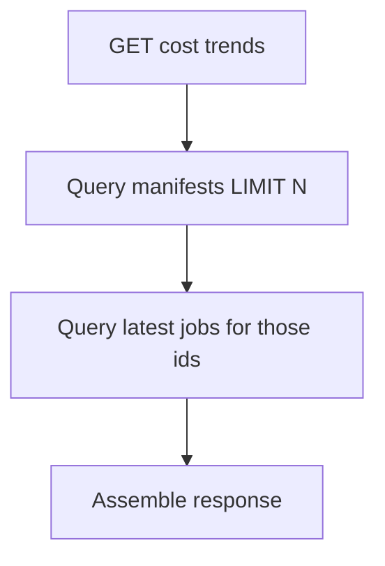

# Change: optimize-cost-metrics-queries

## Why

Some metrics endpoints use N+1 queries and/or load entire tables into memory to compute totals. This can make dashboards slow as data grows, even though the same results can be computed with grouped SQL.

This is a performance hotspot for business UX: dashboards are supposed to feel “instant”.

## Root Cause

### 1) Cost per document trends uses N+1 queries
`getCostPerDocumentTrends()` fetches N manifests and then does one `findOne()` job query per manifest to get the latest job.

ASCII:
```
GET /metrics/cost-per-document-trends
  -> SELECT manifests LIMIT N
  -> for each manifest:
       SELECT latest job for manifest (x N)
```

### 2) Budget alerts loads all jobs then reduces in memory
`checkBudgetAlerts()` loads all jobs for the month and reduces them to a sum, instead of letting the DB compute SUM.

## What Changes

### A) Replace per-manifest latest-job lookups with a single query

Compute “latest job per manifest” using one query (join + subquery, window function, or DISTINCT ON).

Pseudocode:
```
manifests = select manifests LIMIT N
latestJobs = select latest job per manifestId for those manifests (single query)
join in memory
```

Mermaid:


### B) Compute monthly spend with SUM in SQL

For budget alerts:
- use `SUM(job.actualCost)` (or the proper derived cost expression) with user+date predicates
- avoid loading the entire job list

Pseudocode:
```
spent = SELECT COALESCE(SUM(actualCostExpr),0) FROM jobs WHERE userId AND createdAt>=startOfMonth
```

## Impact

- Affected specs:
  - `openspec/specs/backend-standards/spec.md` (performance: avoid N+1 patterns)
- Affected code (implementation later):
  - API: `src/apps/api/src/metrics/cost-metrics.service.ts`

## Non-goals

- Changing the metric definitions or UI design.

