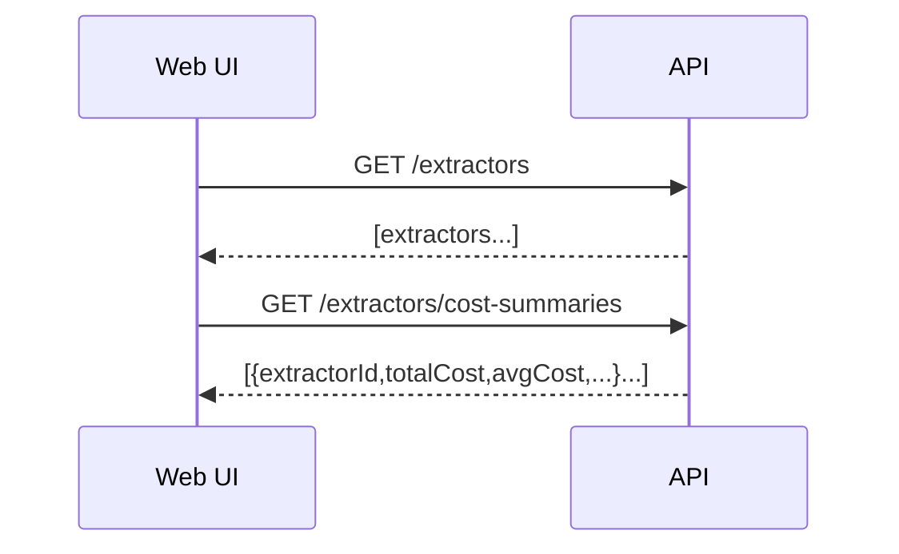

# Change: bulk-extractor-cost-summaries

## Why

The Extractors list UI currently fetches cost summaries with an N+1 pattern (one request per extractor). With many extractors, the page becomes slow and noisy (many parallel requests), even though the data can be computed in one query server-side.

This is a performance hotspot that directly affects perceived responsiveness.

## Root Cause

Web UI behavior:
- `ExtractorsPage` performs `Promise.all(extractors.map(getCostSummary))` which triggers a request per extractor.

ASCII:
```
Load ExtractorsPage
  GET /extractors
  GET /extractors/:id/cost-summary   (x N)
```

## What Changes

### A) Add a bulk cost summaries endpoint

Add a new API endpoint:
- `GET /api/extractors/cost-summaries`
- Returns: `ExtractorCostSummaryDto[]` for all extractors visible to the user

Optional query filtering MAY be added later (e.g. `?ids=...`) but the default all-extractors call should be supported for the list page.

Pseudocode:
```
extractors = listExtractors()
summaries = computeCostSummariesGroupedByExtractor(extractors)
return summaries
```

Mermaid:


### B) Update ExtractorsPage to use the bulk endpoint

Replace the per-extractor `Promise.all` fetch with a single query call, and build a map by `extractorId` in the client.

Pseudocode:
```
summaries = GET /extractors/cost-summaries
map = indexBy(summaries, extractorId)
```

## Impact

- Affected specs:
  - `openspec/specs/extraction/spec.md` (cost summary endpoints)
  - `openspec/specs/web-app/spec.md` (extractors page performance expectations)
- Affected code (implementation later):
  - API: `ExtractorCostService` / `ExtractorsController` (new route)
  - Web: `ExtractorsPage` (single fetch)

## Non-goals

- Changing cost calculation rules.
- Adding caching layers prematurely.

