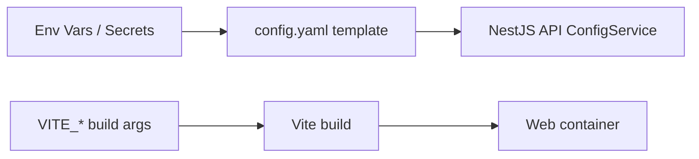

# Design: Fix Deployment Config Drift

## Problem Map
```
Kubernetes (Helm)
  - config.yaml missing keys -> API config validation fails
  - VITE_* set at runtime -> Vite bundle ignores it

Docker Compose
  - builds from ./src/apps/* -> Dockerfiles expect repo root -> build fails
  - env var names drift from config.yaml template -> confusing
```

## Configuration Sources (target)


## Option A vs Option B (Web)
**Decision:** Option A (build-time) for this change.

### Option A (build-time)
Pros: simplest, matches Vite model
Cons: requires environment-specific web images

### Option B (runtime injection)
Pros: one image for many envs
Cons: adds a small runtime config mechanism + app bootstrap change
