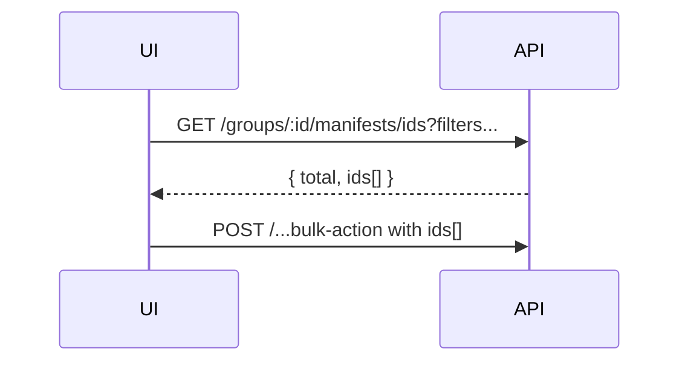

# Change: fix-export-and-batch-scope-ux

## Why

Two core user flows behave inconsistently or feel slow:

1) **Excel export**: the XLSX export is invoice-centric (hard-coded `invoice.*` fields), which is confusing for any project using a different schema.
2) **Batch actions (export/validate/delete)**: the UI pre-fetches large pages of manifests (full DTOs) to compute IDs, which can feel slow and unnecessary.

Additionally, one filter UX is ambiguous:
- **OCR “Unprocessed”**: the server currently treats `ocrQualityMin=0&ocrQualityMax=0` as “unprocessed” but includes `ocrQualityScore = 0` too, which can misclassify truly-processed results.

## Root Cause

### 1) XLSX export is not schema-driven
`XlsxExportService.writeManifestsSheet()` writes a fixed invoice-shaped layout:
- headers include `po_no`, `invoice_date`, `department_code`, `usage`
- values are read from `extractedData.invoice.*` and `extractedData.department.*`

This conflicts with the schema-driven approach used elsewhere (e.g. CSV export).

### 2) Batch scope modal loads full manifests to compute IDs
`ManifestBatchScopeModal` pages through `GET /groups/:groupId/manifests` with `pageSize=200` and accumulates full manifest objects to derive IDs and eligibility.

ASCII:
```
Open modal
  -> fetch page 1 (200 manifests, full payload)
  -> fetch page 2 ...
  -> until all (<= 5000)
But the modal mostly needs ids + counts
```

### 3) “Unprocessed” OCR filter mixes NULL and 0
`applyStandardFilters()` treats `ocrQualityMin=0&ocrQualityMax=0` as:
`ocrQualityScore IS NULL OR ocrQualityScore = 0`

That makes “unprocessed” ambiguous if 0 is a real score.

## What Changes

### A) Make XLSX export schema-driven (like CSV)

Manifests sheet columns MUST be derived from the active schema’s `x-table-columns` when present, otherwise fall back to a JSON-stringified extractedData column.

Pseudocode:
```
columns = resolveSchemaColumns(project.defaultSchemaId)
if columns empty:
  add column extractedDataJson
else:
  add columns in x-table-columns order
```

Mermaid:
```mermaid
flowchart TD
  A[Export XLSX] --> B[XlsxExportService]
  B --> C[Resolve schema columns]
  C --> D[Write Manifests sheet (metadata + schema columns)]
  D --> E[Write Items sheet + Meta sheet]
```

### B) Ensure export filter parity with the manifests list

Export endpoints that accept filters MUST support the same filter semantics as the manifests list, including:
- `ocrQualityMin` / `ocrQualityMax`
- `extractionStatus`
- `costMin` / `costMax`
- `textExtractorId` / `extractorType`
- dynamic extracted-data filters (`filter[...]`)

This avoids “Export failed” surprises when users apply filters in the list UI.

### C) Avoid client-side “full DTO paging” for batch actions

Add a lightweight IDs endpoint:
- `GET /api/groups/:groupId/manifests/ids`
- Accepts the same filters/sort semantics as `GET /api/groups/:groupId/manifests`
- Returns `{ ids: number[], total: number }`
- Enforces a server-side maximum (e.g. 5000) and returns a helpful error when exceeded

UI changes:
- Batch scope modal uses `/manifests/ids` to compute eligible IDs (no full manifest payload paging).
- Export “filtered” may call server-side filtered export endpoints directly when possible (no ID enumeration).

Mermaid:


### D) Make “Unprocessed OCR” filter unambiguous

Change server behavior:
- Treat `ocrQualityMin=0&ocrQualityMax=0` as **only** `ocrQualityScore IS NULL` (unprocessed)
- Treat `ocrQualityScore = 0` as a valid “poor” processed score (and it remains selectable via the “poor” range filter)

### E) Prevent pathological export sizes

CSV export should enforce a maximum manifest count (same order of magnitude as XLSX) and provide a clear error message suggesting narrower filters.

## Impact

- Affected specs:
  - `openspec/specs/excel-export/spec.md` (schema-driven manifests sheet)
  - `openspec/specs/csv-export/spec.md` (export filter parity expectations)
  - `openspec/specs/manifest-filtering/spec.md` (OCR unprocessed semantics)
  - `openspec/specs/web-app/spec.md` (batch modal performance behavior)
- Affected code (implementation later):
  - API: `XlsxExportService`, manifests controller/service (new `.../ids` endpoint), OCR unprocessed filtering rule
  - Web: `ManifestBatchScopeModal` and callers

## Non-goals

- Rewriting the entire export subsystem.
- Changing authorization/permissions behavior.
