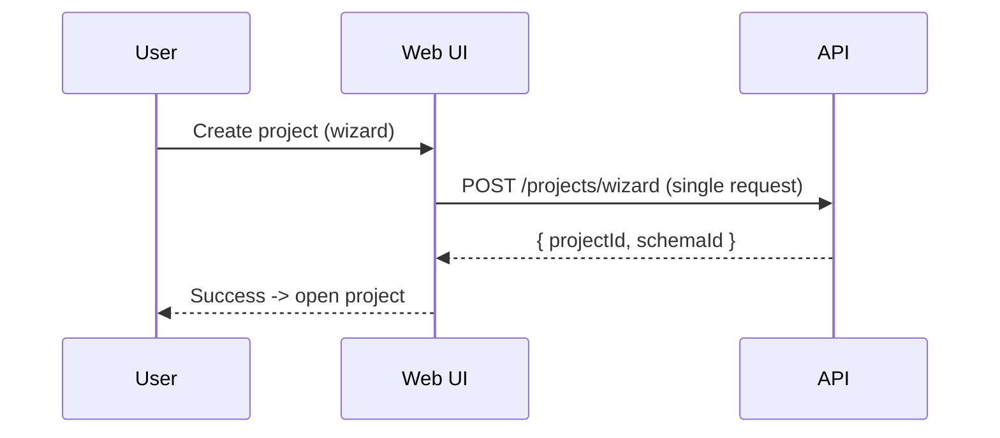
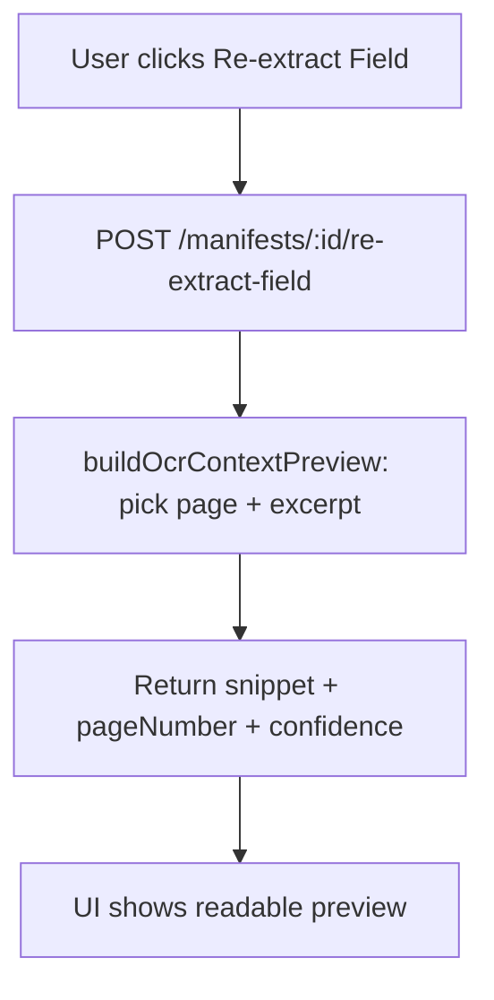

# Change: fix-onboarding-preview-ux

## Why

Three user-facing flows create confusion and wasted time:

1) **Guided Setup Wizard**: creating a project is a multi-step chain (project → schema → rules/scripts). If any later step fails, the UI shows an error even though some resources may already be created. Users can’t reliably tell what happened or how to recover.
2) **Field re-extract preview**: “OCR context preview” currently returns the entire document text as the “snippet”, which makes the preview hard to use and can be slow.
3) **Secret masking / recheck**: users want to confirm configs early, but masked secrets can be copied/revealed as if they were real. The correct “recheck” mechanism should be connection tests, not server-side secret reveal.

## Root Cause

### 1) Wizard partial-success failure mode
`GuidedSetupWizard.handleCreate()` issues multiple independent API calls. Any failure after the first call means partial state is possible and the error message is ambiguous.

ASCII:
```
Create Project (ok)
  -> Create Schema (ok)
     -> Create Rules (fail)
=> UI says "failed", but project+schema exist
```

### 2) Re-extract preview returns full text
`buildOcrContextPreview()` builds `fullText` (all pages joined) and returns it as `snippet` even when it finds a match on a specific page.

### 3) Masked secrets are treated like real secrets in UI
The UI can “Show” and “Copy” whatever is in the input. If the server returns masked placeholders, copy/reveal can mislead users into thinking they saw/used the actual secret.

## What Changes

### A) Make Guided Setup atomic (preferred) + recovery UX

Add a single API endpoint that performs wizard creation in one server-side transaction:
- `POST /api/projects/wizard`
- Creates: project, schema, schema rules, validation scripts
- Returns: `{ projectId, schemaId }`

UI uses this endpoint so “Create” is all-or-nothing.

Pseudocode:
```
transaction {
  project = createProject(...)
  schema = createSchema(project.id, jsonSchema)
  createRules(schema.id, rules[])
  createScripts(project.id, scripts[])
  return { projectId: project.id, schemaId: schema.id }
}
```

If we keep the current multi-call approach temporarily, the UI MUST at least:
- show “Project created but setup incomplete”
- offer “Open project” and “Retry setup”

### B) Make re-extract preview a real snippet

Change OCR preview response to return a short excerpt around the best match:
- prefer the page where the field label matches
- cap snippet length (example: 800–1200 chars)
- include `pageNumber` and `confidence` when available

Pseudocode:
```
pageText = page.markdown || page.text
idx = findAnyCandidate(pageText, [normalizedField, rawField])
if idx >= 0:
  snippet = excerpt(pageText, idx, contextBefore=250, contextAfter=550)
else:
  snippet = excerpt(firstPageText, 0, 0, 800)
```

### C) “Recheck secrets” via Test Connection (no secret reveal)

Make “verify config early” a first-class UX:
- In model/extractor config screens, add/keep **Test Connection** actions that call existing endpoints:
  - `POST /api/models/:id/test`
  - `POST /api/extractors/:id/test`
- Treat `********` as a masked placeholder in UI:
  - “Copy secret” disabled when value is masked
  - “Show secret” only reveals user-typed value in this session (not server-stored)

## Architecture Notes (UX-focused)





```mermaid
flowchart TD
  A[User sees masked secret ********] --> B[Test Connection]
  B --> C[POST /models/:id/test or /extractors/:id/test]
  C -->|ok| D[Verified (latency + timestamp)]
  C -->|fail| E[Show actionable error]
```

## Impact

- Affected specs:
  - `openspec/specs/projects/spec.md` (wizard create semantics)
  - `openspec/specs/extraction/spec.md` (re-extract preview snippet semantics)
  - `openspec/specs/models/spec.md` (secret masking + recheck UX expectations)
  - `openspec/specs/web-app/spec.md` (UI behavior for masked secrets and wizard recovery)
- Affected areas (implementation later):
  - API: projects controller/service (new wizard endpoint), manifests OCR preview builder, extractor/model response masking
  - Web: GuidedSetupWizard, secret inputs, config pages to expose Test Connection

## Non-goals

- Introducing server-side “reveal stored secret” endpoints.
- Adding new auth/roles/permissions work (tracked elsewhere).
- Reworking the queue/progress websocket architecture.

