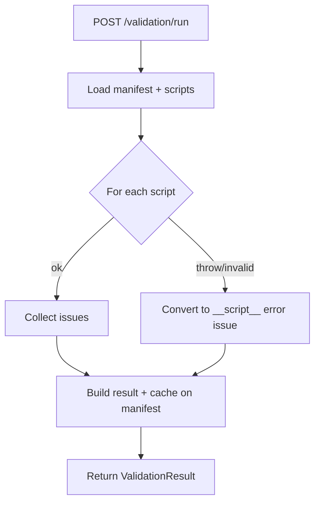

# Change: Surface Validation Script Implementation Errors as Validation Issues

## Why

Today, a validation script can fail at runtime (throw, timeout, or return an invalid shape) and the user will only see a server log. In the UI this often appears as a successful validation run with no issues, which is misleading and slows down debugging.

## Root Cause

- `ValidationService.runValidation()` executes scripts in a loop and catches per-script execution failures to keep the run moving.
- The caught exception is logged, but no user-visible issue is returned, so results can look like “passed” even when a script is broken.

## What Changes

- When a validation script fails during execution, the system SHALL add a validation issue:
  - `field="__script__"`
  - `severity="error"`
  - `message` explains it is a **script implementation error** and includes script name/id.
- Validation continues to run remaining scripts even if one fails.
- The resulting validation run returns a non-zero `errorCount` when any scripts fail.

## UX (ASCII)

### Script execution failure becomes visible

```
[Run validation]
  -> Script A returns issues: OK
  -> Script B throws / returns wrong type:
       issues += [{ field:"__script__", severity:"error", message:"...script implementation error..." }]
  -> UI shows errors instead of "passed"
```

## Implementation (Pseudo-code)

```
issues = []
for script in scripts:
  try:
    issues += execute(script)
  catch err:
    issues += [toScriptImplementationErrorIssue(script, err)]
return buildResult(issues)
```

## Architecture (Mermaid)



## Impact

- Affected specs: `validation-scripts`
- Affected code (expected):
  - `src/apps/api/src/validation/validation.service.ts`
- Dependencies: none
- Breaking changes: none (response schema unchanged; only `issues` content changes)

## Non-Goals

- Failing the entire validation request on the first broken script (keep partial results).
- Adding UI-specific formatting/links for script errors (handled by existing validation results UI).

