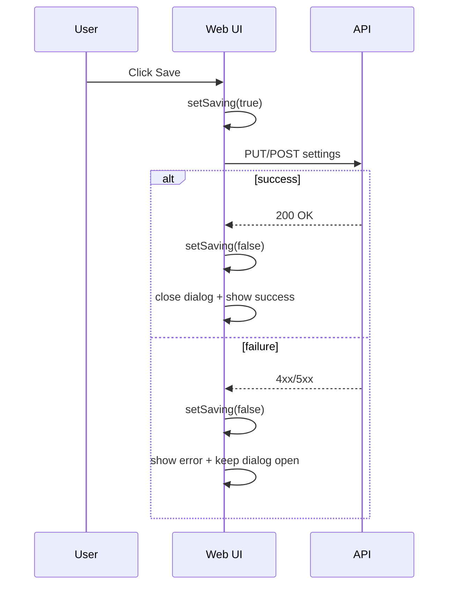

# Change: Harden settings save UX (no stuck spinners, clear errors)

## Why
Some project/model settings pages set a local `isSaving=true` and await an API call without `try/finally`. If the API call rejects, the UI can remain permanently blocked behind a "Saving..." overlay and the user gets no actionable error feedback.

## Root Cause
Async save handlers are missing consistent error handling and always-reset logic:

```
setIsSaving(true)
await apiCall()   <-- throws => next lines never run
setIsSaving(false)
closeDialog()
```

This pattern appears in multiple settings pages and one pricing editor, which also logs errors to console instead of showing user-visible messages.

## What Changes
- Standardize "save" handlers across settings pages to:
  - always clear loading state via `try/finally`
  - show a user-visible error message on failure (localized using existing `getApiErrorText`)
  - keep the dialog open on failure so the user can retry
- Update pricing config editor to show an inline error (not only `console.error`)
- Keep changes minimal: no new dependencies; reuse existing `useModalDialog` / toast patterns

## UX Flow (ASCII)

### Current (broken on failure)
```
User -> Click Save
UI   -> isSaving=true, show overlay
API  -> 500/timeout
UI   -> (exception) overlay stays forever, no error shown
```

### Proposed
```
User -> Click Save
UI   -> isSaving=true, disable actions
API  -> (success) -> UI shows success, closes dialog
API  -> (failure) -> UI shows error, stays open, isSaving=false
```

## UX Flow (Mermaid)


## Implementation Sketch (pseudocode)
```
async function handleSave() {
  if (saving) return
  setError(null)
  setSaving(true)
  try {
    await mutation()
    closeDialog()
    toastSuccess()
  } catch (e) {
    setError(getApiErrorText(e, t))
  } finally {
    setSaving(false)
  }
}
```

## Impact
- Affected specs: `web-app`
- Affected code (examples, not exhaustive):
  - `src/apps/web/src/routes/dashboard/ProjectSettingsBasicPage.tsx`
  - `src/apps/web/src/routes/dashboard/ProjectSettingsModelsPage.tsx`
  - `src/apps/web/src/routes/dashboard/ProjectSettingsExtractorsPage.tsx`
  - `src/apps/web/src/shared/components/models/ModelPricingConfig.tsx`

