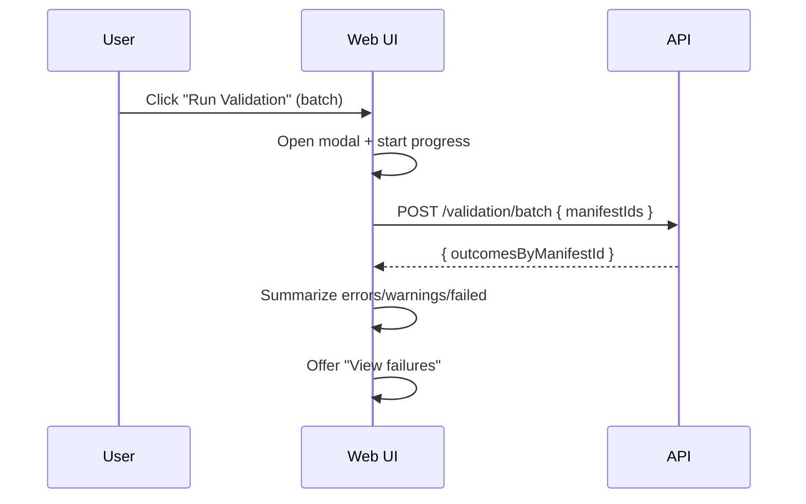

# Change: Improve batch validation UX feedback and performance

## Why
Batch validation is a “bulk action” where users expect a clear outcome: how many succeeded, how many failed, and what to do next. Today the backend swallows per-manifest errors and the UI aggregates only returned results, which can misleadingly report “complete” even when some manifests failed validation execution.

## Root Cause
The API currently:
- executes batch validation sequentially (slow for large sets)
- catches errors per manifest and continues without returning a structured error result
- returns a sparse object map, so missing keys look like “no issues”

The UI currently:
- assumes returned values are the full set, so failures can be invisible

## What Changes
- Change `POST /validation/batch` response shape to return an outcome for every requested manifest id:
  - success: `{ ok: true, result: ValidationResult }`
  - failure: `{ ok: false, error: { message, code? } }`
- Add server-side concurrency limiting for batch validation (to reduce wall time without overwhelming CPU)
- Update manifests list batch validation modal to:
  - show progress and a final summary including `errors`, `warnings`, and `failed`
  - offer “View failures” list (manifest id + message) for quick remediation

## UX Flow (ASCII)

### Current (can be misleading)
```
User -> Run Batch Validation
API  -> validates some, silently skips failures
UI   -> "complete" + totals computed from partial results
User -> thinks all validated (but some didn't)
```

### Proposed
```
User -> Run Batch Validation
UI   -> show progress: done/total
API  -> returns per-manifest outcome (ok/error)
UI   -> summary: errors/warnings/failed + view failures
```

## UX Flow (Mermaid)


## Implementation Sketch (pseudocode)
Server:
```
outcomes = {}
queue = manifestIds
workers = N concurrent tasks:
  while next id:
    try:
      r = runValidation(id)
      outcomes[id] = { ok: true, result: r }
    catch e:
      outcomes[id] = { ok: false, error: { message: safeMessage(e) } }
return outcomes
```

Client:
```
outcomes = await runBatchValidation(ids)
failed = ids.filter(id => outcomes[id]?.ok === false || !outcomes[id])
errors = sum(outcomes[id].result.errorCount)
warnings = sum(outcomes[id].result.warningCount)
```

## Impact
- Affected specs: `validation-scripts`, `web-app`
- Affected code:
  - `src/apps/api/src/validation/validation.service.ts`
  - `src/apps/api/src/validation/validation.controller.ts`
  - `src/apps/web/src/shared/components/manifests/ManifestList.tsx`

