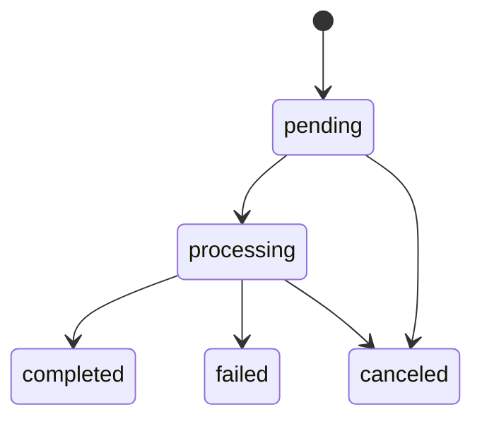

# Design: Job Cancel + Manifest Projections

## Cancellation (target behavior)


### Cancellation check (pseudocode)
```text
API cancel request:
  authorize(user owns manifest)
  write cancel flag (Redis key, TTL)
  persist cancelRequestedAt (DB)

Worker:
  before/after each stage:
    if cancel flag set -> mark job canceled; stop
```

## Manifest projections
Moved to `refactor-manifest-filters-schema-driven` (schema-driven, no invoice-only assumptions).
