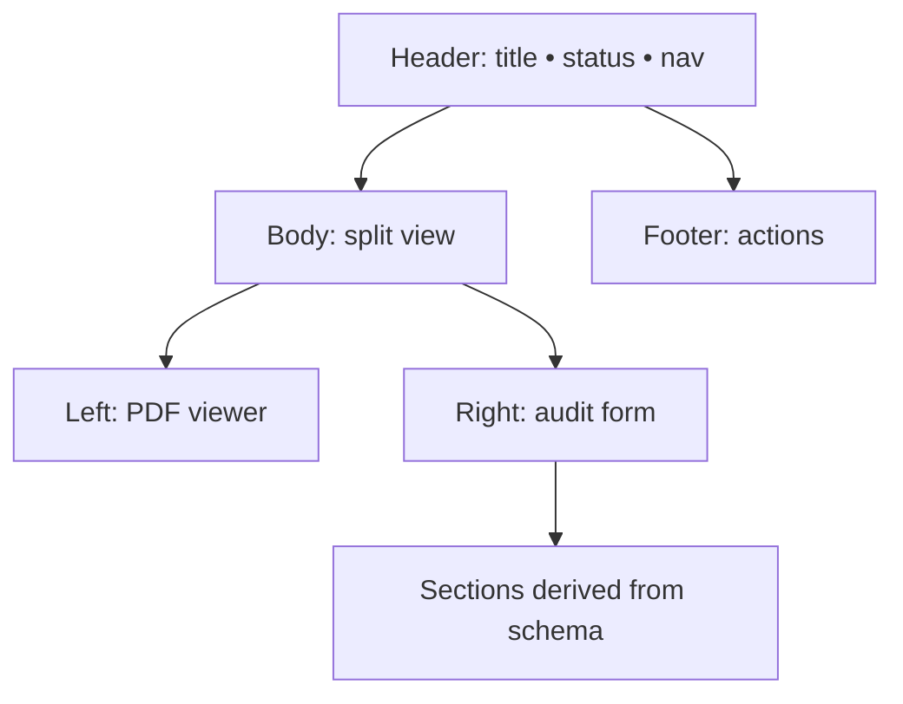
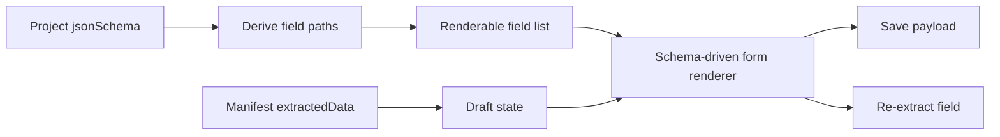

# Design: Manifest audit UX + schema-driven form

## Goals
- Make the audit experience feel like a dedicated workspace (scan fast, edit fast).
- Ensure the audit form adapts automatically to project schema changes.
- Preserve existing productivity features (hints, confidence, re-extract).

## Supported schema subset (v1)
- Objects with `properties`
- Leaf types: `string`, `number`, `integer`, `boolean`
- Basic string formats (best-effort): `date`, `date-time`
- Arrays:
  - Arrays of objects (`type: "array"` + `items` object schema) are editable using schema-defined properties (no hardcoded field names)
  - Other arrays (non-object items) are out of scope for editable UI in v1 (can be skipped or shown read-only)

## Information Architecture
- Top-level object keys become sections (e.g., `invoice.*`, `department.*`).
- Within a section, leaf fields are ordered deterministically:
  1) `required` fields (in schema order if possible)
  2) remaining fields (alphabetical)
 - Only two blocks remain “special” (non-schema):
   - `humanVerified` (explicit verification control)
   - `_extraction_info` (extraction issues + confidence metadata + LLM guidance context)

## UX layout (inspired by `audit_page/index.html`)



### Scrolling rules
- PDF column scrolls independently within its own pane.
- Form column scrolls independently within its own pane.
- Header/footer stay fixed/sticky within the page layout to avoid losing navigation/actions.

## Field rendering pipeline



## Pseudocode (core flow)

```text
schema = project.defaultSchema.jsonSchema
fieldDefs = deriveLeafFields(schema)  // [{ path, type, format?, required?, title? }]

draft = merge(manifest.extractedData, { humanVerified })

render:
  for section in groupByTopLevel(fieldDefs):
    renderSectionHeader(section.name)
    for field in section.fields:
      value = getNested(draft.extractedData, field.path)
      hint = hintMap[field.path] || hintMap[parentPath(field.path)]
      confidence = confidences[field.path]
      renderInput(field, value, hint, confidence)
        onChange(newValue):
          draft.extractedData = setNested(draft.extractedData, field.path, newValue)
          onSave(draft) (debounced)
        onReExtract():
          onReExtractField(field.path)

  // arrays-of-objects are rendered from schema (including items)
  for arrayField in arrayObjectFields:
    renderArrayEditor(arrayField, draft.extractedData[arrayField.path])

save:
  onSave({ extractedData: draft.extractedData, humanVerified: draft.humanVerified })
```

## Risks & mitigations
- **Schema complexity**: limit scope to a supported subset; skip unsupported nodes safely.
- **Type mismatch**: parse inputs conservatively and preserve raw values when uncertain.
- **UX overload**: default to showing required + present fields; allow “show all fields” toggle if needed.
