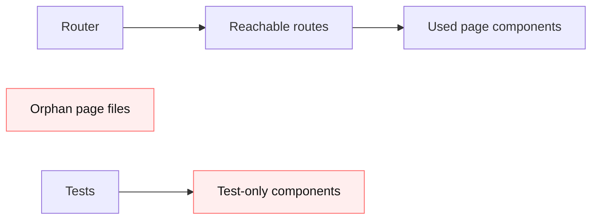

# Change: Remove unused web pages and components

## Why

The repo contains several page/components that are not reachable from the router or are only referenced by tests. Keeping them increases maintenance cost (extra code paths, extra tests, extra mocks) and creates confusion about what the product actually supports.

## Root Cause

Past UI/routing simplification removed navigation and/or route registration, but the files (and in some cases, their tests) remained.

Evidence (current repo state):
- Unreferenced pages (only defined, never imported):
  - `src/apps/web/src/routes/dashboard/SchemaDetailPage.tsx:16`
  - `src/apps/web/src/routes/dashboard/ValidationScriptsPage.tsx:16`
- Unreferenced components (only defined, never imported):
  - `src/apps/web/src/shared/components/Placeholder.tsx:1`
  - `src/apps/web/src/shared/components/manifests/CostLogModal.tsx:119`
- “Test-only” components (used by tests but not by app code):
  - `src/apps/web/src/shared/components/manifests/ExtractionCostTracker.tsx:31`
  - `src/apps/web/src/shared/components/manifests/ExtractionProgressView.tsx:41`
  - `src/apps/web/src/shared/components/manifests/QuickOcrPeek.tsx:21`
  - `src/apps/web/src/shared/components/manifests/SchemaTestMode.tsx:38`

Potential conflicts to resolve before implementation:
- `openspec/changes/improve-create-edit-modals/tasks.md:6` references `SchemaDetailPage`
- `openspec/changes/improve-create-edit-modals/tasks.md:8` references `ValidationScriptsPage`

## What Changes

- Remove unused pages:
  - Delete `SchemaDetailPage` and `ValidationScriptsPage` (and any tests if present).
- Remove unused components:
  - Delete `Placeholder` and `CostLogModal`.
- Resolve “test-only” components:
  - Either integrate into real UI (preferred if they represent a needed UX), or remove the components + tests.
  - This proposal chooses removal to match the goal (“remove unused”).

## Non-Goals

- Changing backend behavior or APIs.
- Adding new replacement pages/workflows (can be a follow-up proposal if needed).

## Architecture Touchpoints (current → proposed)

```text
Current:
  Router -> (no routes) -> [SchemaDetailPage, ValidationScriptsPage] files still exist
  App code -> (no imports) -> [Placeholder, CostLogModal] files still exist
  Tests -> import -> [ExtractionCostTracker, ExtractionProgressView, QuickOcrPeek, SchemaTestMode]

Proposed:
  Delete unreachable files and remove test-only UI unless product needs it.
```



## Implementation Sketch (pseudocode)

```text
for each candidate in [SchemaDetailPage, ValidationScriptsPage, Placeholder, CostLogModal]:
  assert no imports in production code
  delete file

for each candidate in [ExtractionCostTracker, ExtractionProgressView, QuickOcrPeek, SchemaTestMode]:
  assert only referenced in tests
  delete component file + its tests

run web tests/lint/typecheck
```

## Impact

- Affected specs: `web-app`
- Affected code (expected):
  - `src/apps/web/src/routes/dashboard/SchemaDetailPage.tsx`
  - `src/apps/web/src/routes/dashboard/ValidationScriptsPage.tsx`
  - `src/apps/web/src/shared/components/Placeholder.tsx`
  - `src/apps/web/src/shared/components/manifests/CostLogModal.tsx`
  - `src/apps/web/src/shared/components/manifests/ExtractionCostTracker.tsx`
  - `src/apps/web/src/shared/components/manifests/ExtractionProgressView.tsx`
  - `src/apps/web/src/shared/components/manifests/QuickOcrPeek.tsx`
  - `src/apps/web/src/shared/components/manifests/SchemaTestMode.tsx`
  - Related `*.test.tsx` files referencing these components

## Breaking Changes

- None for normal users (these pages/components are not reachable from the app router).
- Minor for developers: removal of test-only components may reduce coverage for flows not yet wired up.

## Risks / Trade-offs

- These files might represent planned UX work; deleting them means re-adding later if needed.
- Active OpenSpec changes that reference these pages should be updated or re-scoped.

## Acceptance Criteria

- No unused page/component files remain for the listed candidates.
- `npm run test`, `npm run lint`, `npm run type-check` pass after implementation.
- `openspec validate remove-unused-web-pages-components --strict` passes.

## Open Questions

- Should any of the “test-only” components be wired into real UI instead of removed?

