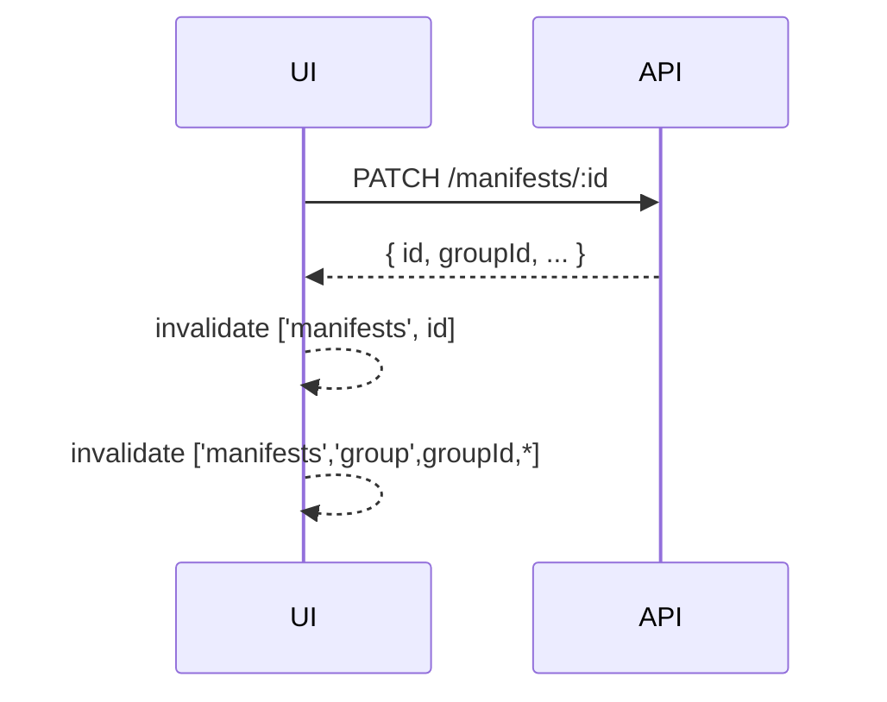

# Change: targeted-manifest-cache-invalidation

## Why

Editing or deleting a single manifest currently triggers broad cache invalidations for *all* manifest list queries, which can cause unnecessary refetches and UI jank (especially while auditing and auto-saving).

This is a UX/performance hotspot: users feel “the list refreshes for no reason” and the network churn grows with more open tabs/groups.

## Root Cause

In `useUpdateManifest`, `useDeleteManifest`, and other mutations, the web invalidates a generic prefix key:

ASCII:
```
PATCH /manifests/:id
  -> invalidate ['manifests', id] (good)
  -> invalidate ['manifests', 'group'] (too broad)
```

## What Changes

### A) Invalidate only the relevant group list

When a manifest mutation completes, the client should invalidate:
- the manifest detail query: `['manifests', manifestId]`
- the specific list query scope for that manifest’s `groupId`: `['manifests', 'group', groupId]`

Pseudocode:
```
updated = PATCH /manifests/:id
invalidate(['manifests', updated.id])
invalidatePrefix(['manifests','group', updated.groupId])
```

For delete (no response body), derive groupId from cache:
```
cached = getQueryData(['manifests', manifestId])
if cached?.groupId:
  invalidatePrefix(['manifests','group', cached.groupId])
else:
  invalidatePrefix(['manifests','group'])
```

Mermaid:


## Impact

- Affected specs:
  - `openspec/specs/web-app/spec.md` (list responsiveness during edits)
- Affected code (implementation later):
  - Web: `src/apps/web/src/shared/hooks/use-manifests.ts`

## Non-goals

- Reworking the websocket progress system.
- Adding caching libraries.

