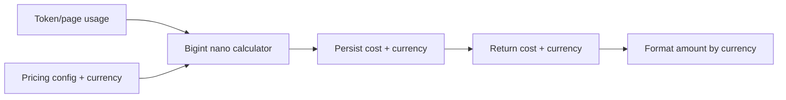

## Goal

Make cost calculations deterministic and currency-safe without adding new production dependencies.

## Data Flow (ascii)

`usage (tokens/pages)` -> `pricing (per 1M / per page / fixed)` -> `nano-unit calc (bigint)` -> `round once` -> `API DTO` -> `UI formatting`

## Key Decision: Integer Nano Units

We represent money internally as integer nano units (1e-9):
- `1 USD` == `1_000_000_000 nanoUSD`
- A per-1M-token price like `0.15` can be represented precisely as `150_000_000 nanoUSD`.

This avoids floating point drift when:
- multiplying tokens/pages by prices
- summing many small costs

## Rounding Rule

- Convert configured prices to nano units using: `priceNano = round(price * 1e9)`.
- For token pricing (per 1M): `costNano = round((tokens * pricePerMillionNano) / 1_000_000)`.
- For page pricing: `costNano = tokens/pages * priceNano` (exact integer multiply).
- Convert to API/storage numeric by rounding to 9 fractional digits once at the boundary.

## Mixed Currency Policy

- The system MUST NOT produce a single total that combines different currencies.
- For aggregations, the API returns totals grouped by currency (e.g., `{ USD: 1.23, EUR: 0.45 }`).
- The UI shows one row per currency; if currency is missing, show “unknown”.

## Mermaid (high-level)

