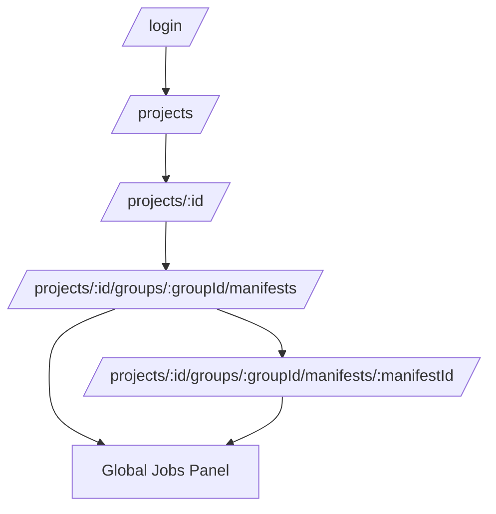

# Proposal: Update Web App UX Polish (Clarity + A11y + Consistency)

## Why

Several high-traffic UI surfaces have small mismatches between user expectations and what the UI communicates:
- The global Jobs panel uses a “Completed” label that also includes failed/canceled jobs, which is confusing when users want to quickly verify success.
- The dashboard sidebar can be visually hidden while still remaining in the keyboard focus order, creating “invisible focus” traps.
- The guided setup wizard contains hardcoded English strings in an otherwise localized UI, causing mixed-language experiences.
- Confidence signals are presented in ways that can be ambiguous (or rely on color cues) when the numeric confidence column is hidden by default.
- The Audit header shows `storagePath`, which is not meaningful to most users and can leak internal details.

### Root cause

The UI has multiple “secondary presentation layers” (side panels, overlays, derived indicators) that were implemented incrementally:

```
Data/state  ->  UI label/affordance  ->  User mental model
   OK                 ✗                       ✗
```

When these layers drift (labels don’t match filters; hidden elements remain focusable; strings bypass i18n), the UX feels unreliable even if the core functionality works.

## What Changes

This proposal focuses on UX clarity + accessibility improvements without changing core backend behavior.

### 1) Jobs panel status semantics
- “Completed” tab shows only `status === completed`.
- “Failed” tab shows failed/canceled (or a renamed “Finished” tab if we want terminal states grouped).
- Add clear, spec-defined mapping between job status and the Jobs panel tabs.

### 2) Sidebar focusability when hidden
- When the sidebar is closed (mobile) or collapsed (desktop), it MUST NOT be reachable by keyboard focus.
- Ensure the hidden sidebar is removed from the tab order (render conditionally or apply `inert`/equivalent).

### 3) Guided setup wizard localization
- Replace hardcoded wizard labels/buttons with i18n keys so language switching applies consistently.

### 4) Confidence signal clarity in manifest list
- If confidence is used as a visual cue (e.g., row border), add a non-color cue (text/label/badge/tooltip + screen reader text).
- Ensure users can understand “why this row is highlighted” even when Confidence column is hidden.

### 5) Schema column filter value scope clarity
- When “available values” are derived from the current page only, label them as “Values from this page”.
- (Optional future work) Server-side distinct values for all results is out of scope here.

### 6) Audit header information hygiene
- Remove `storagePath` from the visible Audit header, or replace it with user-meaningful metadata.

## Goals
- Reduce user confusion and “double checking” behavior during high-frequency flows (Jobs panel, manifests list, audit).
- Improve keyboard accessibility in dashboard navigation.
- Keep UI language switching consistent (no mixed-language pages).
- Avoid adding new production dependencies.

## Non-Goals
- Changing backend job lifecycle semantics or status naming.
- Implementing server-side distinct-value enumerations for schema column filters.
- Large visual redesigns; this is polish, not a rebrand.

## Architecture (user flow context)



## Implementation Notes (pseudocode)

### Jobs panel tab semantics
```text
terminal = {completed, failed, canceled}

if tab == "inProgress": show !terminal
if tab == "completed": show status == completed
if tab == "failed": show status in {failed, canceled}
if tab == "all": show all
```

### Sidebar focusability
```text
if sidebar is hidden:
  do not render sidebar DOM
  OR set inert=true + aria-hidden=true
  AND ensure children cannot be tabbed to
```

### Wizard strings
```text
replace: "Guided Project Setup" -> t('projects.guidedSetup.title')
replace: "Next" -> t('common.next')
replace: step labels -> t('projects.guidedSetup.steps.basics') ...
```

## Compatibility / Migration
- Frontend-only changes; no API changes.
- Behavior should be strictly more understandable; existing routes and flows remain.

## Risks
- Small risk of regressions in keyboard navigation if sidebar visibility/focus handling is incorrect; mitigate with targeted tests and manual keyboard pass.
- i18n key changes require updating locale catalogs; mitigate by adding keys for both `en` and `zh-CN`.

## Validation Plan
- Update/extend unit tests for affected components (JobsPanel, SidebarNav, GuidedSetupWizard, manifest list indicators).
- Run:
  - `npm run test`
  - `npm run lint`
  - `npm run type-check`

## Open Questions
- Jobs panel tab naming: keep “Completed” + “Failed”, or replace with “Finished” (terminal) + “In progress”?
- Confidence cue: prefer small badge in a default-visible column, or keep border + add tooltip/text label?

